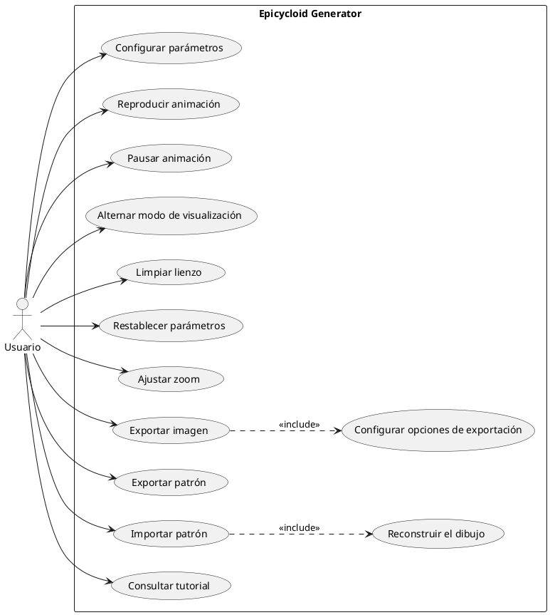
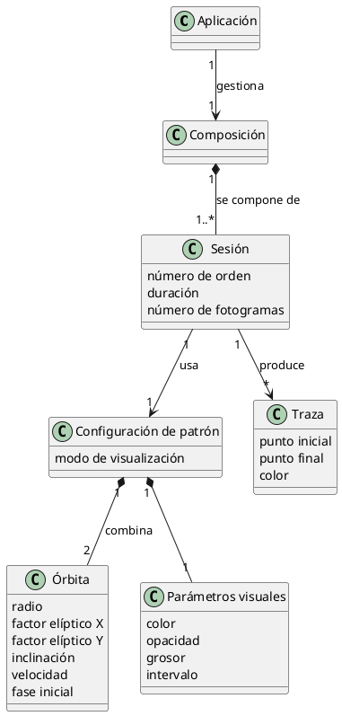
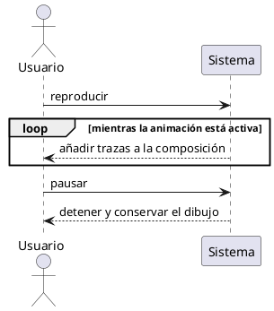

# Capítulo 4 — Análisis

> Borrador del apartado de análisis de la memoria del TFG *Epicycloid Generator*.
> **Nivel conceptual**: describe QUÉ hace el sistema y cómo interactúa el usuario, sin detalles de implementación (esto va antes del capítulo de implementación). Los diagramas no contienen funciones reales ni tecnologías.

---

El presente apartado tiene como objetivo analizar de manera estructurada la aplicación web desarrollada, utilizando herramientas de modelado que permitan comprender tanto los requisitos del sistema como su comportamiento. Para ello se ha empleado Visual Paradigm como entorno de modelado UML, que ha facilitado la elaboración de los diferentes diagramas que sustentan esta fase de análisis.

En primer lugar, se presenta el diagrama de casos de uso, acompañado de sus correspondientes flujos de eventos, que permiten identificar y describir las interacciones entre el usuario y el sistema, detallando el comportamiento esperado ante distintos escenarios. A continuación, se expone el diagrama de clases conceptual, donde se definen las entidades principales del dominio y sus relaciones, sirviendo como base para el posterior diseño. Por último, se incluyen los diagramas de secuencia del sistema, que ilustran el flujo de mensajes entre el usuario y el sistema durante la ejecución de los casos de uso más significativos, permitiendo visualizar la lógica de interacción de la aplicación.

A diferencia de otras aplicaciones, *Epicycloid Generator* es una aplicación web de página única que se ejecuta íntegramente en el navegador, sin necesidad de registro ni de conexión a un servidor. En consecuencia, existe un único actor —el **usuario**— que interactúa de forma directa y anónima con todas las funcionalidades.

## 4.1. Diagrama de casos de uso

Esta herramienta se emplea principalmente durante las etapas de análisis y diseño de un sistema, ya que ayuda a organizar y comprender mejor su desarrollo. El diagrama de casos de uso es una representación gráfica que muestra de forma clara cómo los usuarios (también llamados actores) se relacionan con el sistema, identificando las distintas acciones o funcionalidades que pueden llevar a cabo.

En este caso concreto, hay un único actor (**Usuario**) que interactúa con el sistema (la aplicación web). El usuario puede elegir entre diferentes acciones, llamadas casos de uso. Las acciones a destacar son las siguientes: «Configurar parámetros», «Reproducir animación», «Pausar animación», «Alternar modo de visualización», «Limpiar lienzo», «Restablecer parámetros», «Ajustar zoom», «Exportar imagen», «Exportar patrón», «Importar patrón» y «Consultar tutorial».

A diferencia de aplicaciones con navegación entre múltiples pantallas, aquí todas las funcionalidades conviven en una única vista (el lienzo a la izquierda y el panel de controles a la derecha), por lo que no existe un caso de uso de navegación entre pantallas ni de inicio de sesión. El usuario accede directamente a cualquier acción.

Se han modelado además dos relaciones de inclusión (`«include»`), que representan un comportamiento que forma parte obligatoria de otro caso de uso:

- «Exportar imagen» **incluye** «Configurar opciones de exportación» (fondo, zoom, resolución y guías), ya que la imagen resultante siempre depende de dichas opciones.
- «Importar patrón» **incluye** «Reconstruir el dibujo», puesto que la importación siempre conlleva regenerar la composición a partir de la información del archivo.

*(Aquí va la Figura 4.1: Diagrama de Casos de Uso — ver especificación para Visual Paradigm al final del documento.)*

### 4.1.1. Flujos de eventos de casos de uso

Los flujos de eventos permiten describir cómo se comporta un caso de uso, y se clasifican en dos tipos principales:

- **Flujo principal:** representa la secuencia de pasos más común que sigue el usuario, junto con la respuesta esperada del sistema.
- **Flujos alternativos:** describen rutas diferentes que pueden surgir cuando ocurre alguna situación no prevista dentro del desarrollo normal del caso de uso.

A continuación, se detallan tanto el flujo principal como los posibles flujos alternativos para cada uno de los casos de uso.

---

**CU1: Configurar parámetros**

| Campo | Contenido |
|---|---|
| **ID del caso de uso** | CU1 — Configurar parámetros |
| **Actor principal** | Usuario |
| **Descripción** | El usuario ajusta los parámetros matemáticos y visuales de la composición (radios, velocidades, fases, factores elípticos, inclinación, color, opacidad, grosor e intervalo). |
| **Requisitos cumplidos** | RF2, RF9, RF10 |
| **Precondiciones** | La animación está pausada. |
| **Flujo de eventos** | 1. El usuario abre uno de los grupos de parámetros (Órbita 1, Órbita 2, Visual, Avanzados). 2. El usuario modifica el valor de un control. 3. El sistema registra el nuevo valor y lo refleja inmediatamente en la vista. |
| **Postcondiciones** | Los parámetros activos quedan actualizados y reflejados en el lienzo. |
| **Flujo alternativo** | 2a. Si la animación está en curso, los controles no están disponibles; el usuario debe pausar antes de poder modificar parámetros. |

**CU2: Reproducir animación**

| Campo | Contenido |
|---|---|
| **ID del caso de uso** | CU2 — Reproducir animación |
| **Actor principal** | Usuario |
| **Descripción** | El usuario inicia la animación; el sistema comienza a acumular trazas según los parámetros activos. |
| **Requisitos cumplidos** | RF1, RF3, RF4 |
| **Precondiciones** | Existen parámetros válidos (siempre los hay, por defecto). |
| **Flujo de eventos** | 1. El usuario pulsa «Play». 2. El sistema anima la geometría y va añadiendo las trazas resultantes al lienzo. 3. Los controles se bloquean mientras la animación está activa. |
| **Postcondiciones** | La animación está en marcha y la composición crece progresivamente. |

**CU3: Pausar animación**

| Campo | Contenido |
|---|---|
| **ID del caso de uso** | CU3 — Pausar animación |
| **Actor principal** | Usuario |
| **Descripción** | El usuario detiene la animación en curso. |
| **Requisitos cumplidos** | RF4 |
| **Precondiciones** | La animación está en marcha. |
| **Flujo de eventos** | 1. El usuario pulsa «Pausa». 2. El sistema detiene la animación y conserva el dibujo acumulado. 3. Los controles vuelven a estar disponibles. |
| **Postcondiciones** | La composición queda detenida y editable. |

**CU4: Alternar modo de visualización**

| Campo | Contenido |
|---|---|
| **ID del caso de uso** | CU4 — Alternar modo de visualización |
| **Actor principal** | Usuario |
| **Descripción** | El usuario cambia entre el modo «intersección de líneas» y el modo «curva epicicloidal». |
| **Requisitos cumplidos** | RF8 |
| **Precondiciones** | La animación está pausada. |
| **Flujo de eventos** | 1. El usuario selecciona el otro modo de visualización. 2. El sistema limpia el dibujo actual, ya que ambos modos producen composiciones no comparables. 3. La vista pasa a representar el nuevo modo. |
| **Postcondiciones** | El modo activo queda actualizado y el lienzo, limpio. |

**CU5: Limpiar lienzo**

| Campo | Contenido |
|---|---|
| **ID del caso de uso** | CU5 — Limpiar lienzo |
| **Actor principal** | Usuario |
| **Descripción** | El usuario borra el dibujo acumulado sin alterar los parámetros. |
| **Requisitos cumplidos** | RF5 |
| **Precondiciones** | Ninguna. |
| **Flujo de eventos** | 1. El usuario pulsa «Limpiar lienzo». 2. El sistema borra la composición y reinicia el punto de partida de la animación. |
| **Postcondiciones** | El lienzo queda vacío; los parámetros se mantienen. |

**CU6: Restablecer parámetros**

| Campo | Contenido |
|---|---|
| **ID del caso de uso** | CU6 — Restablecer parámetros |
| **Actor principal** | Usuario |
| **Descripción** | El usuario restaura todos los parámetros a sus valores por defecto. |
| **Requisitos cumplidos** | RF4 |
| **Precondiciones** | Ninguna. |
| **Flujo de eventos** | 1. El usuario pulsa «Reset». 2. El sistema restaura los valores por defecto y borra el dibujo. |
| **Postcondiciones** | Los parámetros vuelven a sus valores iniciales y el lienzo queda limpio. |

**CU7: Ajustar zoom**

| Campo | Contenido |
|---|---|
| **ID del caso de uso** | CU7 — Ajustar zoom |
| **Actor principal** | Usuario |
| **Descripción** | El usuario acerca o aleja la vista del lienzo. |
| **Requisitos cumplidos** | RF11 |
| **Precondiciones** | Ninguna. |
| **Flujo de eventos** | 1. El usuario usa la rueda del ratón sobre el lienzo o los botones ＋/−. 2. El sistema acerca o aleja la vista dentro del rango permitido. |
| **Postcondiciones** | La vista se reescala; la composición no se altera. |

**CU8: Exportar imagen**

| Campo | Contenido |
|---|---|
| **ID del caso de uso** | CU8 — Exportar imagen |
| **Actor principal** | Usuario |
| **Descripción** | El usuario guarda la composición actual como una imagen. **Incluye** «Configurar opciones de exportación». |
| **Requisitos cumplidos** | RF6 |
| **Precondiciones** | Existe un dibujo en el lienzo. |
| **Flujo de eventos** | 1. El usuario solicita exportar la imagen. 2. El sistema muestra una previsualización. 3. El usuario configura fondo, zoom, resolución y visibilidad de guías (caso de uso incluido). 4. El usuario confirma la descarga. 5. El sistema genera y entrega la imagen. |
| **Postcondiciones** | El usuario obtiene una imagen de la composición. |

**CU9: Exportar patrón**

| Campo | Contenido |
|---|---|
| **ID del caso de uso** | CU9 — Exportar patrón |
| **Actor principal** | Usuario |
| **Descripción** | El usuario guarda el estado completo del dibujo en un archivo, para poder recuperarlo más adelante. |
| **Requisitos cumplidos** | RF7 |
| **Precondiciones** | Existe una composición (en curso o ya realizada). |
| **Flujo de eventos** | 1. El usuario solicita exportar el patrón. 2. El sistema reúne la información necesaria para reproducir la composición y la entrega como archivo descargable. |
| **Postcondiciones** | El usuario obtiene un archivo reutilizable. |

**CU10: Importar patrón**

| Campo | Contenido |
|---|---|
| **ID del caso de uso** | CU10 — Importar patrón |
| **Actor principal** | Usuario |
| **Descripción** | El usuario carga un archivo de patrón previamente exportado y recupera el dibujo. **Incluye** «Reconstruir el dibujo». |
| **Requisitos cumplidos** | RF7 |
| **Precondiciones** | El usuario dispone de un archivo de patrón válido. |
| **Flujo de eventos** | 1. El usuario selecciona un archivo de patrón. 2. El sistema reconstruye la composición a partir de la información del archivo (caso de uso incluido). 3. El sistema actualiza los parámetros mostrados al estado del patrón cargado. |
| **Postcondiciones** | La composición importada se muestra y el usuario puede continuarla. |
| **Flujo alternativo** | 1a. Si el archivo no es válido, el sistema descarta la importación e informa de ello. |

**CU11: Consultar tutorial**

| Campo | Contenido |
|---|---|
| **ID del caso de uso** | CU11 — Consultar tutorial |
| **Actor principal** | Usuario |
| **Descripción** | El usuario consulta la guía de bienvenida que explica los modos y los controles básicos. |
| **Requisitos cumplidos** | RNF4 |
| **Precondiciones** | Ninguna. |
| **Flujo de eventos** | 1. En la primera visita, el sistema muestra el tutorial automáticamente. 2. El usuario lee la guía y la cierra (opcionalmente indicando que no desea volver a verla). 3. Posteriormente, el usuario puede reabrirlo cuando quiera. |
| **Postcondiciones** | El usuario conoce el funcionamiento básico de la aplicación. |

## 4.2. Diagrama de clases conceptual

En esta sección se presenta el diagrama de clases conceptual de la aplicación, elaborado como parte del análisis previo al diseño. Su objetivo es ofrecer una visión general que ayude a comprender la estructura lógica del sistema desde una perspectiva orientada a objetos. Se trata de un **modelo de dominio**: representa los conceptos del problema (composiciones, órbitas, sesiones, trazas) y sus relaciones, sin entrar en cómo se implementan.

La aplicación gira en torno a una **composición**, que es el dibujo que el usuario construye. Una composición está formada por una o varias **sesiones**, entendiendo por sesión cada bloque de animación comprendido entre que el usuario reproduce y pausa. Cada sesión utiliza una **configuración de patrón**, que describe completamente el estado matemático y visual: el **modo de visualización**, dos **órbitas** (cada una con su radio, factores elípticos, inclinación, velocidad y fase inicial) y un conjunto de **parámetros visuales** (color, opacidad, grosor e intervalo). El resultado de animar una sesión es una colección de **trazas**, los segmentos o puntos que se acumulan en el lienzo.

Las relaciones principales son: la `Aplicación` *gestiona* una `Composición`; una `Composición` *se compone de* una o varias `Sesión`; cada `Sesión` *usa* una `Configuración de patrón` y *produce* muchas `Traza`; y una `Configuración de patrón` *combina* dos `Órbita` y unos `Parámetros visuales`.

*(Aquí va la Figura 4.2: Diagrama de clases conceptual — ver especificación para Visual Paradigm al final del documento.)*

## 4.3. Diagramas de secuencia del sistema

Los diagramas de secuencia del sistema representan de forma visual y ordenada cómo se desarrollan las interacciones entre el usuario y el sistema a lo largo del tiempo. Se basan en los casos de uso previamente definidos y tratan el sistema como una **caja negra**: muestran las acciones que el usuario realiza y las respuestas que el sistema devuelve, sin detallar su funcionamiento interno (eso corresponde al diseño y la implementación). A continuación se muestran los diagramas de los casos de uso más significativos.

- **Configurar parámetros (CU1):** el usuario solicita modificar un parámetro y el sistema responde actualizando la vista con el nuevo valor.
- **Reproducir animación (CU2):** el usuario solicita reproducir; el sistema anima y acumula trazas de forma continua hasta que el usuario solicita pausar.
- **Exportar imagen (CU8):** el usuario solicita exportar; el sistema muestra una previsualización; el usuario ajusta las opciones y confirma; el sistema entrega la imagen.
- **Importar patrón (CU10):** el usuario selecciona un archivo; el sistema reconstruye el dibujo, lo muestra y actualiza los parámetros visibles.

*(Aquí van las Figuras 4.3 a 4.6 — ver especificación para Visual Paradigm al final del documento.)*

## 4.4. Trazabilidad entre requisitos funcionales y casos de uso

La siguiente tabla establece la relación de trazabilidad entre los requisitos funcionales definidos en el apartado de requisitos y los casos de uso analizados. Este vínculo permite verificar que cada funcionalidad prevista tiene su correspondiente representación en el análisis de comportamiento del sistema.

| Requisito | Descripción | Casos de uso relacionados |
|---|---|---|
| RF1 | Generación de composiciones epicicloidales mediante algoritmos parametrizables | CU2 |
| RF2 | Modificar en tiempo real los parámetros que definen los patrones | CU1 |
| RF3 | Actualizar dinámicamente la representación gráfica sin recargar la página | CU1, CU2 |
| RF4 | Iniciar, pausar y reiniciar la animación | CU2, CU3, CU6 |
| RF5 | Limpiar el lienzo y generar una nueva composición desde cero | CU5 |
| RF6 | Guardar la composición como imagen | CU8 |
| RF7 | Almacenar configuraciones de parámetros y recuperarlas posteriormente | CU9, CU10 |
| RF8 | Alternar entre modos de visualización (curva e intersección de líneas) | CU4 |
| RF9 | Controles interactivos (sliders, selectores, campos numéricos) | CU1 |
| RF10 | Mostrar en pantalla los valores actuales de los parámetros | CU1 |
| RF11 | Visualización responsiva del lienzo, adaptándose a la ventana del navegador | CU7 |
| RF12 | Generación de variaciones automáticas mediante valores aleatorios controlados | *No implementado — sin caso de uso asociado* |

Como se observa en la matriz, todos los requisitos funcionales implementados tienen al menos un caso de uso asociado, lo que garantiza que las funcionalidades previstas han sido contempladas durante el análisis. El único requisito sin caso de uso es RF12 (variación automática de parámetros), por tratarse de una funcionalidad no implementada y propuesta como trabajo futuro. Conviene matizar que RF3 y RF11 describen además comportamientos automáticos del sistema —la actualización inmediata de la vista al modificar un parámetro y el reajuste del lienzo cuando cambia el tamaño de la ventana—, que no constituyen acciones explícitas del usuario pero quedan reflejados en el caso de uso más próximo.

---

# Anexo — Construcción de los diagramas en Visual Paradigm

> Especificación conceptual de cada diagrama (elementos + relaciones) para reproducirlos en **Visual Paradigm**. No aparece ningún nombre de función ni de tecnología: todo está en lenguaje de dominio, como corresponde a la fase de análisis.

## A.1. Diagrama de casos de uso (Figura 4.1)

**Pasos en Visual Paradigm:**
1. `File → New → Use Case Diagram`.
2. Arrastra un **Actor** y renómbralo `Usuario`.
3. Arrastra un **System (rectángulo de frontera)** y nómbralo `Epicycloid Generator`. Dentro irán todos los óvalos.
4. Crea los 11 **Use Case** (óvalos):
   - Configurar parámetros
   - Reproducir animación
   - Pausar animación
   - Alternar modo de visualización
   - Limpiar lienzo
   - Restablecer parámetros
   - Ajustar zoom
   - Exportar imagen
   - Exportar patrón
   - Importar patrón
   - Consultar tutorial
5. Une `Usuario` con cada uno de los 11 casos de uso mediante una **Association** (línea continua sin flecha).
6. Crea dos casos de uso incluidos:
   - Configurar opciones de exportación
   - Reconstruir el dibujo
7. Traza las relaciones de inclusión con **Include** (flecha discontinua con estereotipo `«include»`, que VP añade solo):
   - `Exportar imagen` ──«include»──▶ `Configurar opciones de exportación`
   - `Importar patrón` ──«include»──▶ `Reconstruir el dibujo`

> **Nota:** la flecha `«include»` parte del caso base (Exportar/Importar) hacia el incluido. El usuario NO se conecta a los casos incluidos (solo a los 11 principales).

## A.2. Diagrama de clases conceptual (Figura 4.2)

> Modelo de dominio. Las clases son **conceptos**, no componentes de software. Atributos sin tipo; operaciones solo como acciones del dominio si se desea.

**Pasos en Visual Paradigm:**
1. `File → New → Class Diagram`.
2. Crea las clases conceptuales con sus atributos:
   - `Aplicación`
   - `Composición`
   - `Sesión` — atributos: número de orden, duración, número de fotogramas
   - `Configuración de patrón` — atributo: modo de visualización (curva | líneas)
   - `Órbita` — atributos: radio, factor elíptico X, factor elíptico Y, inclinación, velocidad, fase inicial
   - `Parámetros visuales` — atributos: color, opacidad, grosor, intervalo
   - `Traza` — atributos: punto inicial, punto final, color
3. Traza las relaciones:
   - `Aplicación` ──▶ `Composición` (**Association**, 1 a 1, *gestiona*)
   - `Composición` ◆── `Sesión` (**Composition**, 1 a 1..*, *se compone de*)
   - `Sesión` ──▶ `Configuración de patrón` (**Association**, 1 a 1, *usa*)
   - `Sesión` ──▶ `Traza` (**Association**, 1 a *, *produce*)
   - `Configuración de patrón` ◆── `Órbita` (**Composition**, 1 a 2, *combina*)
   - `Configuración de patrón` ◆── `Parámetros visuales` (**Composition**, 1 a 1)

> Ajusta las multiplicidades en los extremos de cada conector (botón derecho → Multiplicity). Fíjate en el `1 a 2` de las órbitas: siempre hay exactamente dos.

## A.3. Diagramas de secuencia del sistema (Figuras 4.3–4.6)

**Pasos en Visual Paradigm:** `File → New → Sequence Diagram`. En cada diagrama coloca solo dos líneas de vida: el **Actor** `Usuario` y un objeto `Sistema` (el sistema como caja negra). Traza los **Message** en el orden indicado. Para las respuestas usa **mensaje de retorno** (flecha discontinua) y, donde se indique, un **Combined Fragment** tipo `loop`.

- **Fig. 4.3 — Configurar parámetros (CU1):**
  1. Usuario → Sistema: modificar parámetro
  2. Sistema ⤍ Usuario: actualizar vista *(retorno)*

- **Fig. 4.4 — Reproducir animación (CU2):** con un fragmento `loop` «mientras la animación está activa».
  1. Usuario → Sistema: reproducir
  2. *(loop)* Sistema ⤍ Usuario: añadir trazas a la composición
  3. Usuario → Sistema: pausar
  4. Sistema ⤍ Usuario: detener y conservar el dibujo *(retorno)*

- **Fig. 4.5 — Exportar imagen (CU8):**
  1. Usuario → Sistema: solicitar exportar imagen
  2. Sistema ⤍ Usuario: mostrar previsualización *(retorno)*
  3. Usuario → Sistema: configurar opciones (fondo, zoom, resolución, guías)
  4. Usuario → Sistema: confirmar descarga
  5. Sistema ⤍ Usuario: entregar imagen *(retorno)*

- **Fig. 4.6 — Importar patrón (CU10):**
  1. Usuario → Sistema: seleccionar archivo de patrón
  2. Sistema → Sistema: reconstruir el dibujo *(mensaje a sí mismo)*
  3. Sistema ⤍ Usuario: mostrar composición y actualizar parámetros *(retorno)*

---

## A.4. (Opcional) Código PlantUML para vista previa rápida

> Solo para previsualizar antes de montarlo en Visual Paradigm. Los mensajes son conceptuales, sin código.

