# Capítulo 4 — Análisis

> Borrador del apartado de análisis de la memoria del TFG *Epicycloid Generator*.
> **Nivel conceptual**: describe QUÉ hace el sistema y cómo interactúa el usuario, sin detalles de implementación (esto va antes del capítulo de implementación). Los diagramas no contienen funciones reales ni tecnologías.

---

El presente apartado tiene como objetivo analizar de manera estructurada la aplicación web desarrollada, utilizando herramientas de modelado que permitan comprender tanto los requisitos del sistema como su comportamiento. Para ello se ha empleado Visual Paradigm como entorno de modelado UML, que ha facilitado la elaboración de los diferentes diagramas que sustentan esta fase de análisis.

En primer lugar, se presenta el diagrama de casos de uso, acompañado de sus correspondientes flujos de eventos, que permiten identificar y describir las interacciones entre el usuario y el sistema, detallando el comportamiento esperado ante distintos escenarios. A continuación, se expone el diagrama de clases, donde se definen las clases del sistema con sus métodos y relaciones, sirviendo como base para el posterior diseño e implementación. Por último, se incluyen los diagramas de secuencia del sistema, que ilustran el flujo de mensajes —expresados mediante las funciones reales que se ejecutan— entre los componentes durante la ejecución de cada caso de uso, permitiendo visualizar la lógica de interacción de la aplicación.

A diferencia de otras aplicaciones, *Epicycloid Generator* es una aplicación web de página única que se ejecuta íntegramente en el navegador, sin necesidad de registro ni de conexión a un servidor. En consecuencia, existe un único actor —el **usuario**— que interactúa de forma directa y anónima con todas las funcionalidades.

## 4.1. Diagrama de casos de uso

Esta herramienta se emplea principalmente durante las etapas de análisis y diseño de un sistema, ya que ayuda a organizar y comprender mejor su desarrollo. El diagrama de casos de uso es una representación gráfica que muestra de forma clara cómo los usuarios (también llamados actores) se relacionan con el sistema, identificando las distintas acciones o funcionalidades que pueden llevar a cabo.

En este caso concreto, hay un único actor (**Usuario**) que interactúa con el sistema (la aplicación web). El usuario puede elegir entre diferentes acciones, llamadas casos de uso. Las acciones a destacar son las siguientes: «Configurar parámetros», «Generar variación aleatoria», «Reproducir animación», «Pausar animación», «Alternar modo de visualización», «Deshacer última sesión», «Restablecer parámetros», «Ajustar zoom», «Exportar imagen», «Exportar patrón», «Importar patrón», «Consultar tutorial» y «Cambiar idioma».

A diferencia de aplicaciones con navegación entre múltiples pantallas, aquí todas las funcionalidades conviven en una única vista (el lienzo a la izquierda y el panel de controles a la derecha), por lo que no existe un caso de uso de navegación entre pantallas ni de inicio de sesión. El usuario accede directamente a cualquier acción.

Se han modelado además dos relaciones de inclusión (`«include»`), que representan un comportamiento que forma parte obligatoria de otro caso de uso:

- «Exportar imagen» **incluye** «Configurar opciones de exportación» (fondo, zoom, resolución y guías), ya que la imagen resultante siempre depende de dichas opciones.
- «Importar patrón» **incluye** «Reconstruir el dibujo», puesto que la importación siempre conlleva regenerar la composición a partir de la información del archivo.

*(Aquí va la Figura 4.1: Diagrama de Casos de Uso — ver especificación para Visual Paradigm al final del documento.)*

### 4.1.1. Flujos de eventos de casos de uso

Los flujos de eventos permiten describir cómo se comporta un caso de uso, y se clasifican en dos tipos principales:

- **Flujo principal:** representa la secuencia de pasos más común que sigue el usuario, junto con la respuesta esperada del sistema.
- **Flujos alternativos:** describen rutas diferentes que pueden surgir cuando ocurre alguna situación no prevista dentro del desarrollo normal del caso de uso.

A continuación, se detallan tanto el flujo principal como los posibles flujos alternativos para cada uno de los casos de uso.

---

**CU1: Configurar parámetros**

| Campo | Contenido |
|---|---|
| **ID del caso de uso** | CU1 — Configurar parámetros |
| **Actor principal** | Usuario |
| **Descripción** | El usuario ajusta los parámetros matemáticos y visuales de la composición (radios, velocidades, fases, factores elípticos, inclinación, color, opacidad, grosor e intervalo). |
| **Requisitos cumplidos** | RF2, RF9, RF10 |
| **Precondiciones** | La animación está pausada. |
| **Flujo de eventos** | 1. El usuario abre uno de los grupos de parámetros (Órbita 1, Órbita 2, Visual, Avanzados). 2. El usuario modifica el valor de un control. 3. El sistema registra el nuevo valor y lo refleja inmediatamente en la vista. |
| **Postcondiciones** | Los parámetros activos quedan actualizados y reflejados en el lienzo. |
| **Flujo alternativo** | 2a. Si la animación está en curso, los controles no están disponibles; el usuario debe pausar antes de poder modificar parámetros. 2b. Si el usuario introduce un valor fuera del rango permitido, el sistema lo ajusta automáticamente al límite más cercano (mínimo o máximo). |

**CU2: Reproducir animación**

| Campo | Contenido |
|---|---|
| **ID del caso de uso** | CU2 — Reproducir animación |
| **Actor principal** | Usuario |
| **Descripción** | El usuario inicia la animación; el sistema comienza a acumular trazas según los parámetros activos. |
| **Requisitos cumplidos** | RF1, RF3, RF4 |
| **Precondiciones** | Existen parámetros válidos (siempre los hay, por defecto). |
| **Flujo de eventos** | 1. El usuario pulsa «Play». 2. El sistema anima la geometría y va añadiendo las trazas resultantes al lienzo. 3. Los controles se bloquean mientras la animación está activa. |
| **Postcondiciones** | La animación está en marcha y la composición crece progresivamente. |

**CU3: Pausar animación**

| Campo | Contenido |
|---|---|
| **ID del caso de uso** | CU3 — Pausar animación |
| **Actor principal** | Usuario |
| **Descripción** | El usuario detiene la animación en curso. |
| **Requisitos cumplidos** | RF4 |
| **Precondiciones** | La animación está en marcha. |
| **Flujo de eventos** | 1. El usuario pulsa «Pausa». 2. El sistema detiene la animación y conserva el dibujo acumulado. 3. Los controles vuelven a estar disponibles. |
| **Postcondiciones** | La composición queda detenida y editable. |

**CU4: Alternar modo de visualización**

| Campo | Contenido |
|---|---|
| **ID del caso de uso** | CU4 — Alternar modo de visualización |
| **Actor principal** | Usuario |
| **Descripción** | El usuario cambia entre el modo «intersección de líneas» y el modo «curva epicicloidal». |
| **Requisitos cumplidos** | RF8 |
| **Precondiciones** | La animación está pausada. |
| **Flujo de eventos** | 1. El usuario selecciona el otro modo de visualización. 2. El sistema limpia el dibujo actual, ya que ambos modos producen composiciones no comparables. 3. La vista pasa a representar el nuevo modo. |
| **Postcondiciones** | El modo activo queda actualizado y el lienzo, limpio. |

**CU5: Deshacer última sesión**

| Campo | Contenido |
|---|---|
| **ID del caso de uso** | CU5 — Deshacer última sesión |
| **Actor principal** | Usuario |
| **Descripción** | El usuario elimina la última sesión (bloque de animación) dibujada. Cada pulsación sucesiva retira un bloque más, sin afectar al resto de la composición. |
| **Requisitos cumplidos** | RF5 |
| **Precondiciones** | Existe al menos una sesión dibujada o una en curso. |
| **Flujo de eventos** | 1. El usuario solicita deshacer la última sesión. 2. Si hay una animación en curso, el sistema la detiene y la toma como la sesión a eliminar. 3. El sistema elimina la última sesión y reconstruye el dibujo con las sesiones restantes. 4. El sistema restaura los parámetros al estado previo a esa sesión (los de la sesión anterior que permanece en el lienzo). |
| **Postcondiciones** | La última sesión desaparece del lienzo; las anteriores se conservan y los parámetros reflejan el estado previo a la sesión eliminada. |
| **Flujo alternativo** | 1a. Si no existe ninguna sesión dibujada, la acción no está disponible. |

**CU6: Restablecer parámetros**

| Campo | Contenido |
|---|---|
| **ID del caso de uso** | CU6 — Restablecer parámetros |
| **Actor principal** | Usuario |
| **Descripción** | El usuario restaura todos los parámetros a sus valores por defecto. |
| **Requisitos cumplidos** | RF4, RF13 |
| **Precondiciones** | Ninguna. |
| **Flujo de eventos** | 1. El usuario pulsa «Reset». 2. El sistema restaura los valores por defecto y borra el dibujo. |
| **Postcondiciones** | Los parámetros vuelven a sus valores iniciales y el lienzo queda limpio. |

**CU7: Ajustar zoom**

| Campo | Contenido |
|---|---|
| **ID del caso de uso** | CU7 — Ajustar zoom |
| **Actor principal** | Usuario |
| **Descripción** | El usuario acerca o aleja la vista del lienzo. |
| **Requisitos cumplidos** | RF11 |
| **Precondiciones** | Ninguna. |
| **Flujo de eventos** | 1. El usuario usa la rueda del ratón sobre el lienzo o los botones ＋/−. 2. El sistema acerca o aleja la vista dentro del rango permitido. |
| **Postcondiciones** | La vista se reescala; la composición no se altera. |

**CU8: Exportar imagen**

| Campo | Contenido |
|---|---|
| **ID del caso de uso** | CU8 — Exportar imagen |
| **Actor principal** | Usuario |
| **Descripción** | El usuario guarda la composición actual como una imagen. **Incluye** «Configurar opciones de exportación». |
| **Requisitos cumplidos** | RF6 |
| **Precondiciones** | Existe un dibujo en el lienzo. |
| **Flujo de eventos** | 1. El usuario solicita exportar la imagen. 2. El sistema muestra una previsualización. 3. El usuario configura fondo, zoom, resolución y visibilidad de guías (caso de uso incluido). 4. El usuario confirma la descarga. 5. El sistema genera y entrega la imagen. |
| **Postcondiciones** | El usuario obtiene una imagen de la composición. |

**CU9: Exportar patrón**

| Campo | Contenido |
|---|---|
| **ID del caso de uso** | CU9 — Exportar patrón |
| **Actor principal** | Usuario |
| **Descripción** | El usuario guarda el estado completo del dibujo en un archivo, para poder recuperarlo más adelante. |
| **Requisitos cumplidos** | RF7 |
| **Precondiciones** | Existe una composición (en curso o ya realizada). |
| **Flujo de eventos** | 1. El usuario solicita exportar el patrón. 2. El sistema reúne la información necesaria para reproducir la composición y la entrega como archivo descargable. |
| **Postcondiciones** | El usuario obtiene un archivo reutilizable. |

**CU10: Importar patrón**

| Campo | Contenido |
|---|---|
| **ID del caso de uso** | CU10 — Importar patrón |
| **Actor principal** | Usuario |
| **Descripción** | El usuario carga un archivo de patrón previamente exportado y recupera el dibujo. **Incluye** «Reconstruir el dibujo». |
| **Requisitos cumplidos** | RF7 |
| **Precondiciones** | El usuario dispone de un archivo de patrón válido. |
| **Flujo de eventos** | 1. El usuario selecciona un archivo de patrón. 2. El sistema reconstruye la composición a partir de la información del archivo (caso de uso incluido). 3. El sistema actualiza los parámetros mostrados al estado del patrón cargado. |
| **Postcondiciones** | La composición importada se muestra y el usuario puede continuarla. |
| **Flujo alternativo** | 1a. Si el archivo no es válido, el sistema descarta la importación e informa de ello. |

**CU11: Consultar tutorial**

| Campo | Contenido |
|---|---|
| **ID del caso de uso** | CU11 — Consultar tutorial |
| **Actor principal** | Usuario |
| **Descripción** | El usuario consulta la guía de bienvenida que explica los modos y los controles básicos. |
| **Requisitos cumplidos** | RNF4 |
| **Precondiciones** | Ninguna. |
| **Flujo de eventos** | 1. En la primera visita, el sistema muestra el tutorial automáticamente. 2. El usuario lee la guía y la cierra (opcionalmente indicando que no desea volver a verla). 3. Posteriormente, el usuario puede reabrirlo cuando quiera. |
| **Postcondiciones** | El usuario conoce el funcionamiento básico de la aplicación. |

**CU12: Generar variación aleatoria**

| Campo | Contenido |
|---|---|
| **ID del caso de uso** | CU12 — Generar variación aleatoria |
| **Actor principal** | Usuario |
| **Descripción** | El usuario solicita generar una composición «única» asignando de forma automática valores aleatorios al conjunto de parámetros que definen el patrón, conservando el modo de visualización elegido. |
| **Requisitos cumplidos** | RF12 |
| **Precondiciones** | La animación está pausada. |
| **Flujo de eventos** | 1. El usuario solicita aleatorizar los parámetros. 2. El sistema asigna a cada parámetro un valor aleatorio comprendido dentro de su rango permitido (variación *controlada*). 3. El sistema refleja inmediatamente la nueva configuración en la vista. |
| **Postcondiciones** | Los parámetros quedan actualizados con valores aleatorios válidos, listos para reproducirse. |
| **Flujo alternativo** | 1a. Si la animación está en curso, la acción no está disponible; el usuario debe pausar antes de generar una variación. |

**CU13: Cambiar idioma**

| Campo | Contenido |
|---|---|
| **ID del caso de uso** | CU13 — Cambiar idioma |
| **Actor principal** | Usuario |
| **Descripción** | El usuario cambia el idioma de la interfaz seleccionándolo entre los idiomas disponibles. El cambio afecta a todos los textos de la aplicación. |
| **Requisitos cumplidos** | RF14 |
| **Precondiciones** | Ninguna. |
| **Flujo de eventos** | 1. El usuario abre el selector de idioma. 2. El usuario elige uno de los idiomas disponibles. 3. El sistema actualiza inmediatamente todos los textos de la interfaz al idioma seleccionado y conserva la preferencia para futuras visitas. |
| **Postcondiciones** | La interfaz se muestra en el idioma elegido, que queda recordado. |
| **Flujo alternativo** | 1a. **Detección automática:** en el primer acceso, antes de cualquier elección manual, el sistema determina el idioma a partir de la configuración del navegador del usuario y muestra la interfaz en ese idioma; si el idioma del navegador no está disponible, utiliza el idioma predeterminado (inglés). |

**CU14: Aplicar ejemplo predefinido**

| Campo | Contenido |
|---|---|
| **ID del caso de uso** | CU14 — Aplicar ejemplo predefinido |
| **Actor principal** | Usuario |
| **Descripción** | El usuario selecciona uno de los ejemplos de patrones predefinidos que ofrece la aplicación y el sistema ajusta automáticamente todos los parámetros a esa configuración, dejando la composición lista para reproducirse. |
| **Requisitos cumplidos** | RF7 |
| **Precondiciones** | Ninguna. La animación no debe estar en curso. |
| **Flujo de eventos** | 1. El usuario abre el desplegable de ejemplos. 2. El usuario elige uno de los ejemplos disponibles. 3. El sistema ajusta todos los parámetros del panel a la configuración guardada del ejemplo. 4. El usuario pulsa «Play» y el sistema dibuja el patrón correspondiente. |
| **Postcondiciones** | Los parámetros del panel reflejan el ejemplo elegido y la composición se genera al reproducir. |
| **Flujo alternativo** | 2a. **Lienzo en blanco:** el desplegable parte de una opción vacía; si el usuario la mantiene o la vuelve a elegir, el sistema restablece los parámetros por defecto. 3a. Si la animación está en curso, la acción no está disponible; el usuario debe pausar antes de aplicar un ejemplo. 4a. Si tras aplicar el ejemplo el usuario modifica manualmente un parámetro, el desplegable vuelve a la opción vacía, pues la configuración ya no corresponde a un ejemplo con nombre. |

## 4.2. Diagrama de clases

En esta sección se presenta el diagrama de clases de la aplicación. A fin de que sirva de base directa para la implementación, las clases se nombran igual que en el código y se incluyen sus **métodos** (funciones) y los atributos más relevantes, de modo que el pseudocódigo de los diagramas guarde correspondencia con las clases reales del sistema.

La aplicación se estructura en torno a varios **componentes** de interfaz y dos **servicios** compartidos. El componente raíz `AppComponent` contiene los componentes `Canvas` (el lienzo donde se dibuja y anima la composición), `Controls` (el panel de parámetros y acciones) y `Tutorial` (la guía de inicio). El componente `ExportModal` (diálogo de exportación de imagen) se crea bajo demanda desde `Controls`.

La lógica de estado se concentra en el servicio `PatternService`, que mantiene los parámetros activos, el historial de trazas (`lineHistory`) y las sesiones de animación (`sessions`), y ofrece las operaciones para reproducir, pausar, deshacer, exportar y reconstruir la composición. La internacionalización se gestiona en el servicio `I18nService` (idioma activo, detección y persistencia), apoyado por el `TranslatePipe`, que traduce los textos de las plantillas.

El modelo de datos se define mediante las interfaces `PatternParams` (todos los parámetros matemáticos y visuales de la composición), `SimulationSession` (un bloque de animación con sus parámetros y estado final), `LineRecord` (un segmento dibujado), `ExportOptions` (las opciones del diálogo de exportación) y `PatternPreset` (un ejemplo predefinido, con su identificador y la configuración de parámetros que aplica). El catálogo de ejemplos predefinidos (`PATTERN_PRESETS`) que ofrece el desplegable se construye a partir de esta última interfaz y lo consulta `Controls`.

Las relaciones principales son: `AppComponent` *contiene* a `Canvas`, `Controls` y `Tutorial`, y *usa* `I18nService`; `Controls`, `Canvas` y `ExportModal` *usan* `PatternService`; `Controls` *crea* `ExportModal` y *usa* el catálogo de `PatternPreset`; `TranslatePipe` *usa* `I18nService`; y `PatternService` *gestiona* colecciones de `SimulationSession` y `LineRecord`, definidas a partir de `PatternParams`.

*(Aquí va la Figura 4.2: Diagrama de clases — ver especificación para Visual Paradigm al final del documento.)*

## 4.3. Diagramas de secuencia del sistema

Los diagramas de secuencia del sistema representan de forma visual y ordenada cómo se desarrollan las interacciones a lo largo del tiempo durante la ejecución de cada caso de uso. En estos diagramas, en lugar de tratar el sistema como una única caja negra, se reflejan los **componentes reales** que colaboran y las **funciones** (en pseudocódigo) que se invocan en cada paso, lo que permite trazar cada caso de uso con la lógica que realmente se ejecuta. Las líneas de vida son el actor **Usuario** y los componentes que intervienen según el caso: `Controls` (panel de control), `PatternService` (estado y sesiones), `Canvas` (lienzo), `ExportModal` (diálogo de exportación), `Tutorial`, `App` (componente raíz) e `I18nService` (idioma). A continuación se incluye un diagrama para **cada uno** de los casos de uso (CU1–CU14), ordenados según su numeración.

- **Configurar parámetros (CU1) — Figura 4.3:** el usuario solicita modificar un parámetro y el sistema responde actualizando la vista con el nuevo valor.
- **Reproducir animación (CU2) — Figura 4.4:** el usuario solicita reproducir; el sistema anima y acumula trazas de forma continua hasta que el usuario solicita pausar.
- **Pausar animación (CU3) — Figura 4.5:** el usuario solicita pausar y el sistema detiene la animación, conservando el dibujo acumulado.
- **Alternar modo de visualización (CU4) — Figura 4.6:** el usuario selecciona el otro modo; el sistema limpia el lienzo y pasa a representar el nuevo modo.
- **Deshacer última sesión (CU5) — Figura 4.7:** el usuario solicita deshacer; el sistema elimina la última sesión dibujada, reconstruye el resto de la composición y restaura los parámetros al estado previo a esa sesión.
- **Restablecer parámetros (CU6) — Figura 4.8:** el usuario solicita restablecer y el sistema restaura los valores por defecto y limpia el lienzo.
- **Ajustar zoom (CU7) — Figura 4.9:** el usuario acerca o aleja la vista y el sistema la reescala sin alterar la composición.
- **Exportar imagen (CU8) — Figura 4.10:** el usuario solicita exportar; el sistema muestra una previsualización; el usuario ajusta las opciones y confirma; el sistema entrega la imagen.
- **Exportar patrón (CU9) — Figura 4.11:** el usuario solicita exportar el patrón y el sistema entrega un archivo reutilizable con la información de la composición.
- **Importar patrón (CU10) — Figura 4.12:** el usuario selecciona un archivo; el sistema reconstruye el dibujo, lo muestra y actualiza los parámetros visibles.
- **Consultar tutorial (CU11) — Figura 4.13:** el usuario abre la guía, el sistema la muestra y el usuario la cierra.
- **Generar variación aleatoria (CU12) — Figura 4.14:** el usuario solicita aleatorizar y el sistema asigna valores aleatorios válidos y actualiza la vista.
- **Cambiar idioma (CU13) — Figura 4.15:** el usuario selecciona un idioma y el sistema actualiza de inmediato todos los textos de la interfaz, sin recargar la página.
- **Aplicar ejemplo predefinido (CU14) — Figura 4.16:** el usuario elige un ejemplo del desplegable y el sistema ajusta automáticamente todos los parámetros del panel a la configuración guardada, dejándola lista para reproducir.

*(Aquí van las Figuras 4.3 a 4.16 — ver especificación para Visual Paradigm al final del documento.)*

## 4.4. Trazabilidad entre requisitos funcionales y casos de uso

La siguiente tabla establece la relación de trazabilidad entre los requisitos funcionales definidos en el apartado de requisitos y los casos de uso analizados. Este vínculo permite verificar que cada funcionalidad prevista tiene su correspondiente representación en el análisis de comportamiento del sistema.

| Requisito | Descripción | Casos de uso relacionados |
|---|---|---|
| RF1 | Generación de composiciones epicicloidales mediante algoritmos parametrizables | CU2 |
| RF2 | Modificar en tiempo real los parámetros que definen los patrones | CU1 |
| RF3 | Actualizar dinámicamente la representación gráfica sin recargar la página | CU1, CU2 |
| RF4 | Iniciar, pausar y reiniciar la animación | CU2, CU3, CU6 |
| RF5 | Limpiar el lienzo y generar una nueva composición desde cero (mediante el deshacer incremental de sesiones) | CU5 |
| RF6 | Guardar la composición como imagen | CU8 |
| RF7 | Almacenar configuraciones de parámetros predefinidas y recuperarlas posteriormente | CU14, CU9, CU10 |
| RF8 | Alternar entre modos de visualización (curva e intersección de líneas) | CU4 |
| RF9 | Controles interactivos (sliders, selectores, campos numéricos) | CU1 |
| RF10 | Mostrar en pantalla los valores actuales de los parámetros | CU1 |
| RF11 | Visualización responsiva del lienzo, adaptándose a la ventana del navegador | CU7 |
| RF12 | Generación de variaciones automáticas mediante valores aleatorios controlados | CU12 |
| RF13 | Restablecer los parámetros a sus valores predeterminados | CU6 |
| RF14 | Soporte multilingüe: cambiar dinámicamente el idioma de la interfaz | CU13 |

Como se observa en la matriz, todos los requisitos funcionales tienen al menos un caso de uso asociado, lo que garantiza que la totalidad de las funcionalidades previstas han sido contempladas durante el análisis. Conviene matizar que RF3 y RF11 describen además comportamientos automáticos del sistema (la actualización inmediata de la vista al modificar un parámetro y el reajuste del lienzo cuando cambia el tamaño de la ventana), que no constituyen acciones explícitas del usuario pero quedan reflejados en el caso de uso más próximo. De forma análoga, RF14 incorpora un comportamiento automático —la detección del idioma del navegador en el primer acceso— que complementa la acción manual de cambio de idioma recogida en CU13.

---

# Anexo — Construcción de los diagramas en Visual Paradigm

> Especificación de cada diagrama (elementos + relaciones) para reproducirlos en **Visual Paradigm**. El diagrama de **casos de uso** se mantiene a nivel de dominio (acciones del usuario, sin tecnologías). El diagrama de **clases** (A.2) y los de **secuencia** (A.3) usan los **nombres reales de las clases del código** y de sus **funciones** (pseudocódigo), de modo que sirvan de base directa para la implementación.

## A.1. Diagrama de casos de uso (Figura 4.1)

**Pasos en Visual Paradigm:**
1. `File → New → Use Case Diagram`.
2. Arrastra un **Actor** y renómbralo `Usuario`.
3. Arrastra un **System (rectángulo de frontera)** y nómbralo `Epicycloid Generator`. Dentro irán todos los óvalos.
4. Crea los 14 **Use Case** (óvalos):
   - Configurar parámetros
   - Generar variación aleatoria
   - Reproducir animación
   - Pausar animación
   - Alternar modo de visualización
   - Deshacer última sesión
   - Restablecer parámetros
   - Ajustar zoom
   - Exportar imagen
   - Exportar patrón
   - Importar patrón
   - Consultar tutorial
   - Cambiar idioma
   - Aplicar ejemplo predefinido
5. Une `Usuario` con cada uno de los 14 casos de uso mediante una **Association** (línea continua sin flecha).
6. Crea dos casos de uso incluidos:
   - Configurar opciones de exportación
   - Reconstruir el dibujo
7. Traza las relaciones de inclusión con **Include** (flecha discontinua con estereotipo `«include»`, que VP añade solo):
   - `Exportar imagen` ──«include»──▶ `Configurar opciones de exportación`
   - `Importar patrón` ──«include»──▶ `Reconstruir el dibujo`

> **Nota:** la flecha `«include»` parte del caso base (Exportar/Importar) hacia el incluido. El usuario NO se conecta a los casos incluidos (solo a los 14 principales).

## A.2. Diagrama de clases (Figura 4.2)

> Las clases llevan los **nombres reales del código** e incluyen sus **métodos** (funciones) y los atributos principales, expresados en **pseudocódigo** (nombres reales, sin tipos del lenguaje ni marcadores de visibilidad). Los componentes y servicios son clases; el modelo de datos se representa con interfaces (estereotipo `«interface»`).

**Pasos en Visual Paradigm:**
1. `File → New → Class Diagram`.
2. Crea las clases con sus atributos y **operaciones** (botón derecho → Add → Operation):
   - `AppComponent` — atrib.: `langMenuOpen` · métodos: `currentLanguageLabel()`, `selectLang(code)`
   - `Canvas` — atrib.: `params`, `isPaused`, `isDrawing`, `zoom` · métodos: `ngAfterViewInit()`, `ngOnDestroy()`, `zoomIn()`, `zoomOut()`, `onAction(action)`, `initSketch()`
   - `Controls` — atrib.: `params`, `isPlaying`, `showExportModal`, `selectedPresetId`, `presets` · métodos: `onParamChange()`, `applyPreset()`, `toggleMode()`, `play()`, `pause()`, `clear()`, `reset()`, `randomize()`, `clampParams()`, `formatInterval(s)`, `exportJson()`, `triggerImport()`
   - `ExportModal` — atrib.: `options`, `isTransparent`, `exportZoom`, `exportScale` · métodos: `renderPreview()`, `buildExportCanvas()`, `onOptionChange()`, `onTransparentToggle()`, `save()`
   - `Tutorial` — atrib.: `visible`, `dontShowAgain` · métodos: `open()`, `close()`
   - `PatternService` — atrib.: `lineHistory`, `sessions`, `params$`, `action$` · métodos: `updateParams(p)`, `getCurrentParams()`, `dispatch(a)`, `beginSession(p)`, `incrementSessionFrame()`, `setCurrentState(...)`, `endSession()`, `snapshotActiveSession()`, `removeLastSession()`, `replaySessionsToLines(s)`, `clearSessions()`
   - `I18nService` — atrib.: `lang`, `languages` · métodos: `setLang(l)`, `toggle()`, `translate(key)`, `detectInitialLang()`
   - `TranslatePipe` — método: `transform(key)`
   - `«interface» PatternParams` — `orbit1Radius`, `orbit2Radius`, `orbit1SpeedRpm`, `orbit2SpeedRpm`, `initialAngle1/2`, factores elípticos e inclinación, `lineColor`, `lineAlpha`, `strokeWeight`, `lineInterval`, `visualizationMode`
   - `«interface» SimulationSession` — `sessionIndex`, `params`, `frameCount`, `durationSeconds`, `endAngle1/2`, `endTipX/Y`, `endFirstPoint`
   - `«interface» LineRecord` — `x1`, `y1`, `x2`, `y2`, `r`, `g`, `b`, `a`, `sw`
   - `«interface» ExportOptions` — `bgColor`, `showGuides`, `showCenterDot`
   - `«interface» PatternPreset` — `id`, `params`
3. Traza las relaciones:
   - `AppComponent` ◆── `Canvas`, ◆── `Controls`, ◆── `Tutorial` (**Composition**, *contiene*)
   - `AppComponent` ──▶ `I18nService` (**Association/Dependency**, *usa*)
   - `Controls` ──▶ `PatternService`, `Canvas` ──▶ `PatternService`, `ExportModal` ──▶ `PatternService` (*usa*)
   - `Controls` ┄┄▶ `ExportModal` (**Dependency**, *crea*)
   - `TranslatePipe` ──▶ `I18nService` (*usa*)
   - `PatternService` ──▶ `SimulationSession` (1 a *, `sessions`) y ──▶ `LineRecord` (1 a *, `lineHistory`)
   - `SimulationSession` ──▶ `PatternParams` (1 a 1) ; `ExportModal` ──▶ `ExportOptions` (1 a 1)
   - `Controls` ──▶ `PatternPreset` (1 a *, catálogo `PATTERN_PRESETS`, *usa*) ; `PatternPreset` ──▶ `PatternParams` (1 a 1, configuración que aplica)

> Ajusta las multiplicidades en los extremos de cada conector (botón derecho → Multiplicity). Fíjate en el `1 a 2` de las órbitas: siempre hay exactamente dos.

## A.3. Diagramas de secuencia del sistema (Figuras 4.3–4.16)

**Pasos en Visual Paradigm:** `File → New → Sequence Diagram` (uno por cada caso de uso). Coloca las líneas de vida indicadas en cada figura (el **Actor** `Usuario` y los **componentes reales** que intervienen) y traza los **Message** etiquetados con el **nombre de la función** que se ejecuta. Para las respuestas usa **mensaje de retorno** (flecha discontinua); usa **Combined Fragment** `loop`/`alt`/`opt` y **mensaje a sí mismo** (self-message) donde se indique.

- **Fig. 4.3 — Configurar parámetros (CU1):** Usuario, Controls, PatternService, Canvas.
  1. Usuario → Controls: editar un control `(ngModelChange)`
  2. Controls → Controls: `onParamChange()`
  3. Controls → PatternService: `updateParams(params)`
  4. PatternService ⤍ Canvas: `params$` (suscripción)
  5. Canvas → Canvas: `draw()` (refleja los nuevos parámetros)
  6. Usuario → Controls: confirmar valor `(change)` → `clampParams()` → PatternService: `updateParams(params)`

- **Fig. 4.4 — Reproducir animación (CU2):** Usuario, Controls, PatternService, Canvas. Fragmento `loop` «cada fotograma mientras `isDrawing`».
  1. Usuario → Controls: `play()`
  2. Controls → PatternService: `dispatch('play')`
  3. PatternService ⤍ Canvas: `onAction('play')`
  4. Canvas → PatternService: `beginSession(params)`
  5. *(loop)* Canvas: `draw()` → PatternService: `lineHistory.push(record)`, `incrementSessionFrame()`, `setCurrentState(...)`
  6. Usuario → Controls: `pause()` → PatternService: `dispatch('pause')`
  7. PatternService ⤍ Canvas: `onAction('pause')` → Canvas → PatternService: `endSession()`

- **Fig. 4.5 — Pausar animación (CU3):** Usuario, Controls, PatternService, Canvas.
  1. Usuario → Controls: `pause()`
  2. Controls → PatternService: `dispatch('pause')`
  3. PatternService ⤍ Canvas: `onAction('pause')`
  4. Canvas → PatternService: `endSession()`

- **Fig. 4.6 — Alternar modo de visualización (CU4):** Usuario, Controls, PatternService, Canvas.
  1. Usuario → Controls: `toggleMode()`
  2. Controls → PatternService: `updateParams(params)` (nuevo `visualizationMode`)
  3. PatternService ⤍ Canvas: `params$`
  4. Canvas → Canvas: `draw()` (detecta el cambio de modo) → PatternService: `endSession()`, `clearSessions()`

- **Fig. 4.7 — Deshacer última sesión (CU5):** Usuario, Controls, PatternService, Canvas. Fragmentos `alt`.
  1. Usuario → Controls: `clear()`
  2. *(alt `isPlaying`)* Controls → Controls: `pause()` → PatternService: `dispatch('pause')` → `endSession()`
  3. Controls → PatternService: `removeLastSession()`
  4. *(alt quedan sesiones)* PatternService: `sessions.pop()`, `replaySessionsToLines(sessions)`; Controls → PatternService: `updateParams(prevParams)`
  5. Controls → PatternService: `dispatch('undo')`
  6. PatternService ⤍ Canvas: `onAction('undo')` (reconstruye la estela)

- **Fig. 4.8 — Restablecer parámetros (CU6):** Usuario, Controls, PatternService, Canvas.
  1. Usuario → Controls: `reset()`
  2. Controls → PatternService: `updateParams(DEFAULT_PARAMS)`
  3. Controls → PatternService: `dispatch('reset')`
  4. PatternService ⤍ Canvas: `onAction('reset')` → Canvas → PatternService: `endSession()`, `clearSessions()`

- **Fig. 4.9 — Ajustar zoom (CU7):** Usuario, Canvas.
  1. Usuario → Canvas: `mouseWheel()` / `zoomIn()` / `zoomOut()`
  2. Canvas → Canvas: `trailDirty = true` → `draw()` (reescala la vista)

- **Fig. 4.10 — Exportar imagen (CU8):** Usuario, Controls, ExportModal, PatternService. Fragmento `opt`.
  1. Usuario → Controls: `showExportModal = true`
  2. Controls → ExportModal: crear `<app-export-modal>`
  3. ExportModal → ExportModal: `ngAfterViewInit()` → `renderPreview()` → `buildExportCanvas()` (lee `getCurrentParams()`, `lineHistory` de PatternService)
  4. *(opt ajustar opciones)* Usuario → ExportModal: `onTransparentToggle()` / `onOptionChange()` → `renderPreview()`
  5. Usuario → ExportModal: `save()` → `buildExportCanvas()` → `toDataURL()`

- **Fig. 4.11 — Exportar patrón (CU9):** Usuario, Controls, PatternService.
  1. Usuario → Controls: `exportJson()`
  2. Controls → PatternService: `snapshotActiveSession()` + `sessions`
  3. Controls → Controls: construir `Blob` y enlace de descarga

- **Fig. 4.12 — Importar patrón (CU10):** Usuario, Controls, PatternService, Canvas. Fragmento `alt`.
  1. Usuario → Controls: `triggerImport()`
  2. Usuario → Controls: `onFileSelected(event)`
  3. *(alt archivo válido)* Controls → PatternService: `replaySessionsToLines(sessions)`, `updateParams(lastParams)`, `dispatch('import-json')` → PatternService ⤍ Canvas: `onAction('import-json')`
  4. *(else inválido)* Controls → Controls: `catch` (descarta la importación)

- **Fig. 4.13 — Consultar tutorial (CU11):** Usuario, Tutorial.
  1. Usuario → Tutorial: `open()`
  2. Tutorial ⤍ Usuario: muestra la guía (`visible = true`)
  3. Usuario → Tutorial: `close()`

- **Fig. 4.14 — Generar variación aleatoria (CU12):** Usuario, Controls, PatternService, Canvas.
  1. Usuario → Controls: `randomize()`
  2. Controls → Controls: `randInRange()` / `randColor()`
  3. Controls → PatternService: `updateParams(params)`
  4. PatternService ⤍ Canvas: `params$` → `draw()`

- **Fig. 4.15 — Cambiar idioma (CU13):** Usuario, App, I18nService. Fragmento `alt`.
  1. *(alt primer acceso)* I18nService → I18nService: `detectInitialLang()`
  2. Usuario → App: abrir selector (`langMenuOpen = true`)
  3. Usuario → App: `selectLang(code)`
  4. App → I18nService: `setLang(code)` → `lang.set(code)` + `localStorage` + `document.documentElement.lang`
  5. I18nService ⤍ Usuario: `TranslatePipe` (`| t`) reevalúa los textos

- **Fig. 4.16 — Aplicar ejemplo predefinido (CU14):** Usuario, Controls, PatternService, Canvas. Fragmento `alt`.
  1. Usuario → Controls: seleccionar ejemplo en el desplegable (`(ngModelChange)` sobre `selectedPresetId`)
  2. Controls → Controls: `applyPreset()`
  3. *(alt ejemplo elegido)* Controls → Controls: buscar el preset en `PATTERN_PRESETS` y fusionar `params` sobre los valores por defecto
  4. *(else opción vacía)* Controls → Controls: restablecer los parámetros por defecto (lienzo en blanco)
  5. Controls → PatternService: `updateParams(params)`
  6. PatternService ⤍ Canvas: `params$` → `draw()` (al pulsar «Play» se dibuja el patrón)

---

## A.4. (Opcional) Código PlantUML para vista previa rápida

> Solo para previsualizar antes de montarlo en Visual Paradigm. Los diagramas de casos de uso y de clases son conceptuales; los de **secuencia** usan nombres de funciones reales (pseudocódigo) y los componentes reales como líneas de vida.

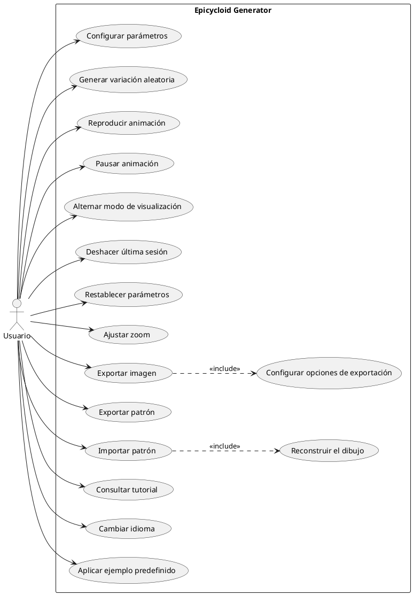

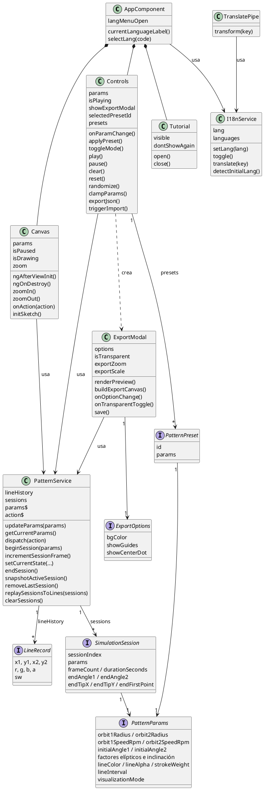

**Figura 4.3 — Configurar parámetros (CU1)**

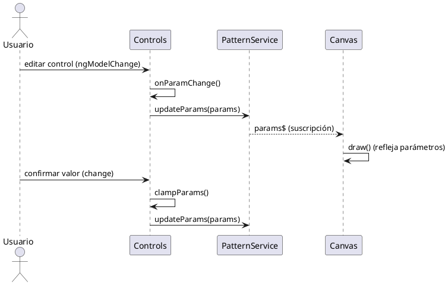

**Figura 4.4 — Reproducir animación (CU2)**

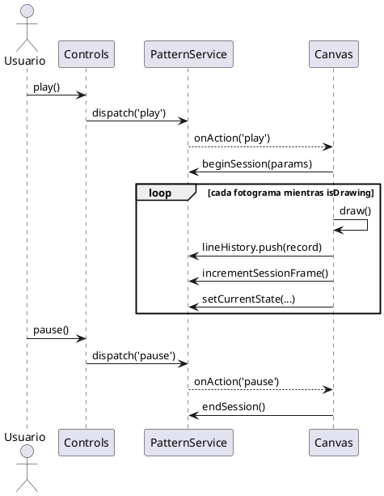

**Figura 4.5 — Pausar animación (CU3)**

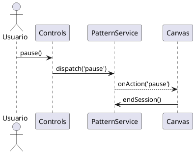

**Figura 4.6 — Alternar modo de visualización (CU4)**

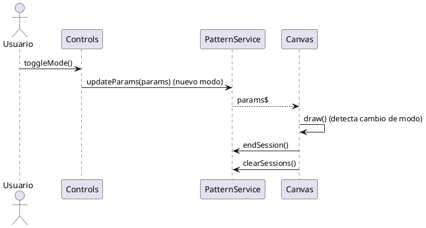

**Figura 4.7 — Deshacer última sesión (CU5)**

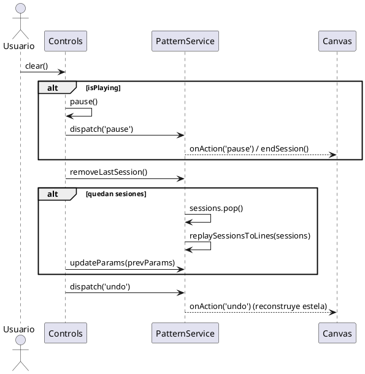

**Figura 4.8 — Restablecer parámetros (CU6)**

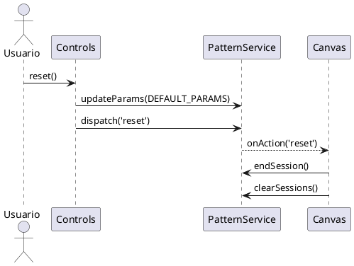

**Figura 4.9 — Ajustar zoom (CU7)**

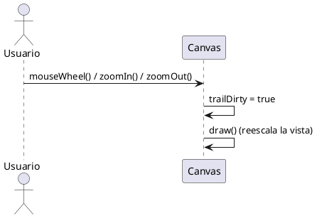

**Figura 4.10 — Exportar imagen (CU8)**

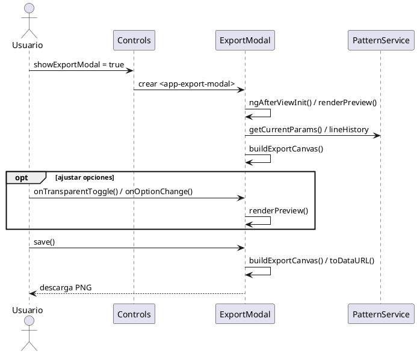

**Figura 4.11 — Exportar patrón (CU9)**

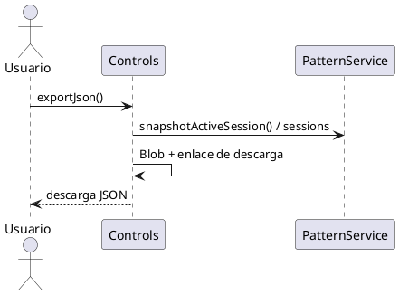

**Figura 4.12 — Importar patrón (CU10)**

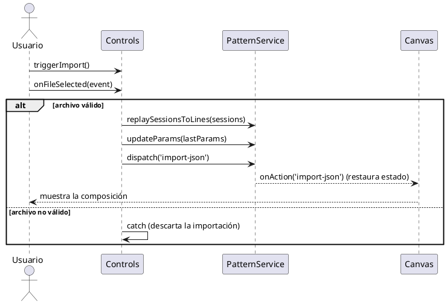

**Figura 4.13 — Consultar tutorial (CU11)**

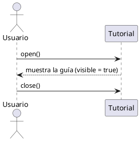

**Figura 4.14 — Generar variación aleatoria (CU12)**

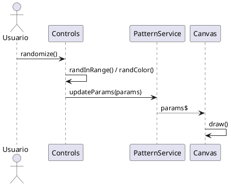

**Figura 4.15 — Cambiar idioma (CU13)**

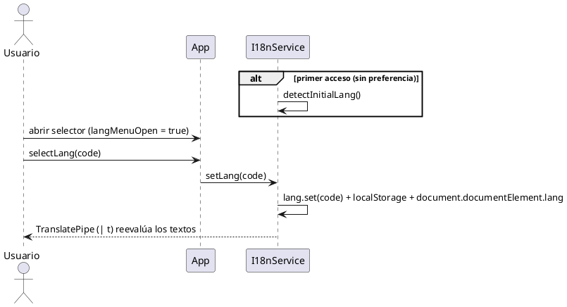

**Figura 4.16 — Aplicar ejemplo predefinido (CU14)**

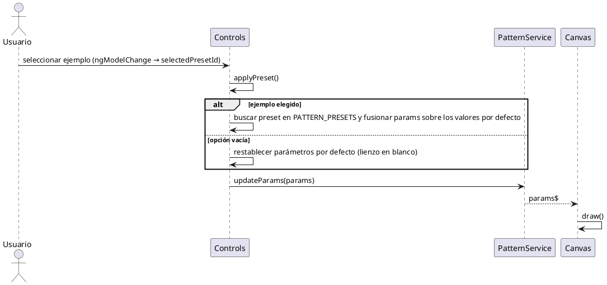
