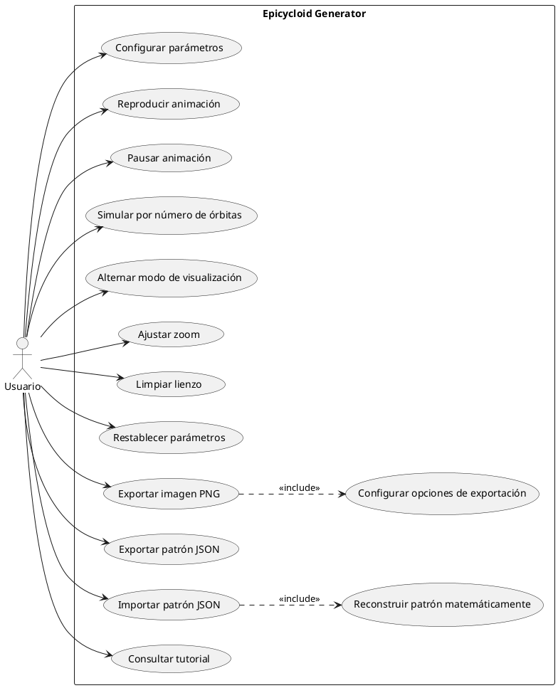
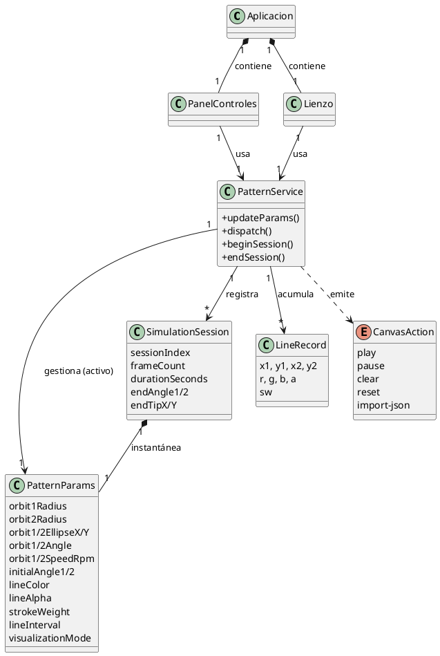
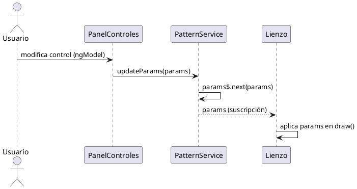
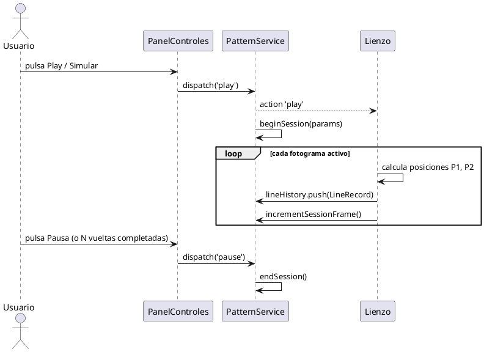
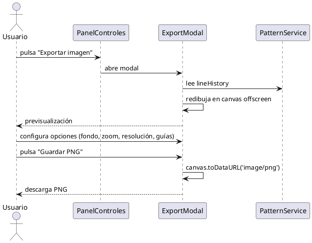
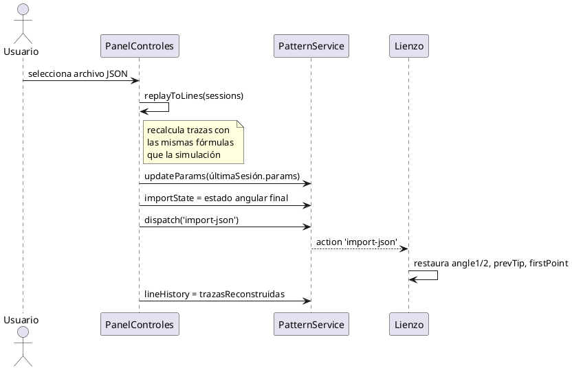

# Capítulo 4 — Análisis

> Borrador del apartado de análisis de la memoria del TFG *Epicycloid Generator*.
> Incluye texto redactado + especificación de los diagramas (con código PlantUML para generarlos).

---

El presente apartado tiene como objetivo analizar de manera estructurada la aplicación web desarrollada, utilizando herramientas de modelado que permitan comprender tanto los requisitos del sistema como su comportamiento interno. Para ello se ha empleado un entorno de modelado UML, que ha facilitado la elaboración de los diferentes diagramas que sustentan esta fase de análisis.

En primer lugar, se presenta el diagrama de casos de uso, acompañado de sus correspondientes flujos de eventos, que permiten identificar y describir las interacciones entre el usuario y el sistema, detallando el comportamiento esperado ante distintos escenarios. A continuación, se expone el diagrama de clases conceptual, donde se definen las entidades principales del dominio y sus relaciones, sirviendo como base para el diseño orientado a objetos. Por último, se incluyen los diagramas de secuencia del sistema, que ilustran el flujo de mensajes entre los componentes durante la ejecución de los casos de uso más significativos, permitiendo visualizar la lógica de interacción de la aplicación.

A diferencia de otras aplicaciones, *Epicycloid Generator* es una aplicación web de página única (SPA) que se ejecuta íntegramente en el navegador, sin backend, sin base de datos y sin sistema de autenticación. En consecuencia, existe un único actor —el **usuario**— que interactúa de forma directa y anónima con todas las funcionalidades, y todo el estado se gestiona en memoria del cliente y mediante archivos JSON/PNG que el propio usuario exporta e importa.

## 4.1. Diagrama de casos de uso

Esta herramienta se emplea principalmente durante las etapas de análisis y diseño de un sistema, ya que ayuda a organizar y comprender mejor su desarrollo. El diagrama de casos de uso es una representación gráfica que muestra de forma clara cómo los usuarios (también llamados actores) se relacionan con el sistema, identificando las distintas acciones o funcionalidades que pueden llevar a cabo.

En este caso concreto, hay un único actor (**Usuario**) que interactúa con el sistema (la aplicación web). El usuario puede elegir entre diferentes acciones, llamadas casos de uso. Las acciones a destacar son las siguientes: «Configurar parámetros», «Reproducir animación», «Pausar animación», «Simular por número de órbitas», «Alternar modo de visualización», «Ajustar zoom», «Limpiar lienzo», «Restablecer parámetros», «Exportar imagen PNG», «Exportar patrón JSON», «Importar patrón JSON» y «Consultar tutorial».

A diferencia de aplicaciones con navegación entre múltiples pantallas, aquí todas las funcionalidades conviven en una única vista (lienzo a la izquierda, panel de controles a la derecha), por lo que no existe un caso de uso de navegación entre pantallas ni de inicio de sesión. El usuario accede directamente a cualquier acción.

Se han modelado además dos relaciones de inclusión (`«include»`), que representan comportamiento obligatorio compartido por un caso de uso:

- «Exportar imagen PNG» **incluye** «Configurar opciones de exportación» (fondo, zoom, resolución y guías), ya que el redibujado de la imagen siempre depende de dichas opciones.
- «Importar patrón JSON» **incluye** «Reconstruir patrón matemáticamente», puesto que la importación siempre dispara la reconstrucción de las trazas a partir de las sesiones del archivo.

*(Aquí va la Figura 4.1: Diagrama de Casos de Uso — ver código PlantUML al final del documento.)*

### 4.1.1. Flujos de eventos de casos de uso

Los flujos de eventos permiten describir cómo se comporta un caso de uso, y se clasifican en dos tipos principales:

- **Flujo principal:** representa la secuencia de pasos más común que sigue el usuario, junto con la respuesta esperada del sistema.
- **Flujos alternativos:** describen rutas diferentes que pueden surgir cuando ocurre alguna situación no prevista dentro del desarrollo normal del caso de uso.

A continuación, se detallan tanto el flujo principal como los posibles flujos alternativos para cada uno de los casos de uso.

---

**CU1: Configurar parámetros**

| Campo | Contenido |
|---|---|
| **ID del caso de uso** | CU1 — Configurar parámetros |
| **Actor principal** | Usuario |
| **Descripción** | El usuario ajusta los parámetros matemáticos y visuales de la simulación (radios, velocidades, fases, factores elípticos, inclinación, color, opacidad, grosor e intervalo). |
| **Requisitos cumplidos** | RF2, RF9, RF10 |
| **Precondiciones** | La simulación está pausada (los controles están habilitados). |
| **Flujo de eventos** | 1. El usuario despliega una de las secciones colapsables del panel (Órbita 1, Órbita 2, Visual, Avanzados). 2. El usuario modifica el valor de un control (slider, campo numérico o selector de color). 3. El sistema actualiza el modelo mediante enlace bidireccional y emite los nuevos parámetros a través del servicio. 4. El lienzo recibe los parámetros y los aplica en el siguiente fotograma. |
| **Postcondiciones** | Los parámetros activos quedan actualizados y reflejados en el lienzo. |
| **Flujo alternativo** | 2a. Si la simulación está en curso, los controles aparecen deshabilitados; el usuario debe pulsar Pausa antes de poder modificar parámetros. |

**CU2: Reproducir animación**

| Campo | Contenido |
|---|---|
| **ID del caso de uso** | CU2 — Reproducir animación |
| **Actor principal** | Usuario |
| **Descripción** | El usuario inicia la animación; el lienzo comienza a acumular trazas según los parámetros activos. |
| **Requisitos cumplidos** | RF1, RF3, RF4 |
| **Precondiciones** | Existen parámetros válidos (siempre los hay, por defecto). |
| **Flujo de eventos** | 1. El usuario pulsa el botón «Play». 2. El sistema abre una nueva sesión de simulación. 3. En cada fotograma, el sistema calcula la posición de los planetas, añade la traza al historial y la dibuja. 4. Los controles se deshabilitan mientras la animación está activa. |
| **Postcondiciones** | La animación está en marcha y el historial de líneas crece fotograma a fotograma. |

**CU3: Pausar animación**

| Campo | Contenido |
|---|---|
| **ID del caso de uso** | CU3 — Pausar animación |
| **Actor principal** | Usuario |
| **Descripción** | El usuario detiene la animación en curso. |
| **Requisitos cumplidos** | RF4 |
| **Precondiciones** | La animación está en marcha. |
| **Flujo de eventos** | 1. El usuario pulsa «Pausa». 2. El sistema cierra la sesión activa y la almacena en el historial de sesiones. 3. Los controles vuelven a habilitarse. |
| **Postcondiciones** | La simulación queda detenida; el dibujo acumulado se conserva. |

**CU4: Simular por número de órbitas**

| Campo | Contenido |
|---|---|
| **ID del caso de uso** | CU4 — Simular por número de órbitas |
| **Actor principal** | Usuario |
| **Descripción** | El usuario ejecuta exactamente N vueltas de una órbita de referencia, deteniéndose la animación automáticamente al completarlas. |
| **Requisitos cumplidos** | RF1, RF4 |
| **Precondiciones** | La órbita de referencia tiene una velocidad distinta de 0 RPM. |
| **Flujo de eventos** | 1. El usuario selecciona la órbita de referencia (1 o 2). 2. El usuario indica el número de vueltas (admite decimales). 3. El usuario pulsa «Simular». 4. El sistema acumula el ángulo de referencia hasta alcanzar `N · 2π` y detiene la animación. 5. El sistema notifica a la interfaz que la simulación ha finalizado. |
| **Postcondiciones** | La animación se detiene tras completar exactamente N vueltas. |
| **Flujo alternativo** | 1a. Si la velocidad de la órbita de referencia es 0 RPM, el ángulo nunca alcanza el objetivo y la simulación no termina (limitación conocida). |

**CU5: Alternar modo de visualización**

| Campo | Contenido |
|---|---|
| **ID del caso de uso** | CU5 — Alternar modo de visualización |
| **Actor principal** | Usuario |
| **Descripción** | El usuario cambia entre el modo «intersección de líneas» y el modo «curva epicicloidal». |
| **Requisitos cumplidos** | RF8 |
| **Precondiciones** | La simulación está pausada. |
| **Flujo de eventos** | 1. El usuario pulsa el botón de alternancia de modo. 2. El sistema detecta el cambio de modo y limpia el historial de líneas (las coordenadas de ambos modos no son comparables). 3. El lienzo pasa a dibujar según el nuevo modo. |
| **Postcondiciones** | El modo de visualización activo queda actualizado y el lienzo, limpio. |

**CU6: Limpiar lienzo**

| Campo | Contenido |
|---|---|
| **ID del caso de uso** | CU6 — Limpiar lienzo |
| **Actor principal** | Usuario |
| **Descripción** | El usuario borra el dibujo acumulado sin alterar los parámetros. |
| **Requisitos cumplidos** | RF5 |
| **Precondiciones** | Ninguna. |
| **Flujo de eventos** | 1. El usuario pulsa «Limpiar lienzo». 2. El sistema vacía el historial de líneas y reinicia los ángulos acumulados a 0. |
| **Postcondiciones** | El lienzo queda vacío; los parámetros se mantienen. |

**CU7: Restablecer parámetros (Reset)**

| Campo | Contenido |
|---|---|
| **ID del caso de uso** | CU7 — Restablecer parámetros |
| **Actor principal** | Usuario |
| **Descripción** | El usuario restaura todos los parámetros a sus valores por defecto. |
| **Requisitos cumplidos** | RF15 |
| **Precondiciones** | Ninguna. |
| **Flujo de eventos** | 1. El usuario pulsa «Reset». 2. El sistema restaura los parámetros por defecto y borra el historial de líneas. |
| **Postcondiciones** | Los parámetros vuelven a sus valores iniciales y el lienzo queda limpio. |

**CU8: Ajustar zoom**

| Campo | Contenido |
|---|---|
| **ID del caso de uso** | CU8 — Ajustar zoom |
| **Actor principal** | Usuario |
| **Descripción** | El usuario acerca o aleja la vista del lienzo. |
| **Requisitos cumplidos** | RF13 |
| **Precondiciones** | Ninguna. |
| **Flujo de eventos** | 1. El usuario gira la rueda del ratón sobre el lienzo o pulsa los botones ＋/−. 2. El sistema aplica el factor de zoom (rango 0,33×–8×) sobre la vista. |
| **Postcondiciones** | La vista se reescala; las coordenadas del historial y la simulación no se ven afectadas. |

**CU9: Exportar imagen PNG**

| Campo | Contenido |
|---|---|
| **ID del caso de uso** | CU9 — Exportar imagen PNG |
| **Actor principal** | Usuario |
| **Descripción** | El usuario guarda la composición actual como una imagen PNG. **Incluye** «Configurar opciones de exportación». |
| **Requisitos cumplidos** | RF6 |
| **Precondiciones** | Existe un dibujo en el historial. |
| **Flujo de eventos** | 1. El usuario pulsa «Exportar imagen». 2. El sistema abre el modal de exportación y muestra una previsualización. 3. El usuario configura fondo, zoom de exportación, resolución y visibilidad de guías (caso de uso incluido). 4. El usuario pulsa «Guardar PNG». 5. El sistema redibuja el historial en un lienzo offscreen y descarga el archivo. |
| **Postcondiciones** | Se descarga una imagen PNG con la composición. |

**CU10: Exportar patrón JSON**

| Campo | Contenido |
|---|---|
| **ID del caso de uso** | CU10 — Exportar patrón JSON |
| **Actor principal** | Usuario |
| **Descripción** | El usuario guarda el estado completo del dibujo como un archivo JSON de sesiones. |
| **Requisitos cumplidos** | RF1, RF2 (persistencia del estado paramétrico) |
| **Precondiciones** | Existe al menos una sesión registrada o una sesión activa. |
| **Flujo de eventos** | 1. El usuario pulsa «Exportar patrón (JSON)». 2. El sistema serializa el historial de sesiones (incluida la activa, si la hay) junto con sus metadatos. 3. El sistema descarga el archivo `.json`. |
| **Postcondiciones** | Se descarga un archivo JSON reproducible. |

**CU11: Importar patrón JSON**

| Campo | Contenido |
|---|---|
| **ID del caso de uso** | CU11 — Importar patrón JSON |
| **Actor principal** | Usuario |
| **Descripción** | El usuario carga un archivo JSON previamente exportado y reconstruye el dibujo. **Incluye** «Reconstruir patrón matemáticamente». |
| **Requisitos cumplidos** | RF1, RF2 |
| **Precondiciones** | El usuario dispone de un archivo JSON válido. |
| **Flujo de eventos** | 1. El usuario pulsa «Importar patrón (JSON)» y selecciona un archivo. 2. El sistema recorre todas las sesiones y recalcula las trazas con las mismas fórmulas que la simulación en tiempo real (caso de uso incluido). 3. El sistema actualiza los parámetros del panel al estado de la última sesión. 4. El sistema restaura el estado angular final para permitir continuar el dibujo. |
| **Postcondiciones** | El dibujo importado se muestra en el lienzo; el usuario puede pulsar Play para continuarlo. |
| **Flujo alternativo** | 1a. Si el archivo no es un JSON válido o no tiene la estructura esperada, el sistema descarta la importación. |

**CU12: Consultar tutorial**

| Campo | Contenido |
|---|---|
| **ID del caso de uso** | CU12 — Consultar tutorial |
| **Actor principal** | Usuario |
| **Descripción** | El usuario consulta la guía de bienvenida que explica los modos y los controles básicos. |
| **Requisitos cumplidos** | RNF4 |
| **Precondiciones** | Ninguna. |
| **Flujo de eventos** | 1. En la primera visita, el sistema muestra el tutorial automáticamente. 2. El usuario lee la guía y la cierra (opcionalmente marcando «No volver a mostrar», que se persiste en `localStorage`). 3. Posteriormente, el usuario puede reabrirlo con el botón «?». |
| **Postcondiciones** | El usuario conoce el funcionamiento básico de la aplicación. |

## 4.2. Diagrama de clases conceptual

En esta sección se presenta el diagrama de clases conceptual de la aplicación, elaborado como parte del análisis previo al diseño e implementación. Su objetivo es ofrecer una visión general que ayude a comprender la estructura lógica del sistema desde una perspectiva orientada a objetos.

La aplicación se organiza en torno a un servicio central (`PatternService`) que actúa como única fuente de estado y bus de comunicación entre el panel de controles y el lienzo. El usuario configura un conjunto de **parámetros** (`PatternParams`) que describen completamente el estado matemático y visual de la simulación. Cada bloque de reproducción entre Play y Pausa constituye una **sesión** (`SimulationSession`), que almacena una instantánea de los parámetros usados y el estado angular final. El dibujo acumulado se representa como una colección de **trazas** (`LineRecord`), cada una con sus coordenadas en espacio mundo, color, opacidad y grosor. Las acciones puntuales sobre el lienzo (play, pause, clear, reset, import) se modelan como un tipo enumerado (`CanvasAction`).

Las relaciones principales son: la `Aplicación` *contiene* un `PanelControles` y un `Lienzo`; ambos *usan* el `PatternService`; el `PatternService` *gestiona* uno o varios `PatternParams` (el activo), una secuencia de `SimulationSession` y una colección de `LineRecord`; y cada `SimulationSession` *contiene* una instantánea de `PatternParams`.

*(Aquí va la Figura 4.2: Diagrama de clases conceptual — ver código PlantUML al final del documento.)*

## 4.3. Diagramas de secuencia del sistema

Los diagramas de secuencia representan de forma visual y ordenada cómo se desarrollan las interacciones entre los distintos elementos del sistema a lo largo del tiempo. Se basan en los casos de uso previamente definidos y permiten detallar el flujo de mensajes entre el usuario y los componentes del sistema (panel de controles, servicio y lienzo). A continuación se muestran los diagramas de los casos de uso más significativos.

- **Configurar parámetros (CU1):** el usuario modifica un control → el panel actualiza el modelo y llama a `updateParams()` → el servicio emite los parámetros por el `BehaviorSubject` → el lienzo, suscrito, los aplica en el siguiente fotograma.
- **Reproducir / Simular (CU2/CU4):** el usuario pulsa Play → el panel despacha la acción → el servicio abre sesión → el lienzo, en cada fotograma, calcula posiciones, añade trazas e incrementa el contador de la sesión → al pausar o completar las vueltas, se cierra la sesión.
- **Exportar imagen PNG (CU9):** el usuario abre el modal → configura opciones → el modal redibuja el historial sobre un lienzo offscreen y genera el PNG → se descarga.
- **Importar patrón JSON (CU11):** el usuario selecciona el archivo → el panel ejecuta `replayToLines()` reconstruyendo las trazas → actualiza parámetros → despacha `import-json` → el lienzo restaura el estado angular y sustituye el historial.

*(Aquí van las Figuras 4.3 a 4.6 — ver código PlantUML al final del documento.)*

## 4.4. Trazabilidad entre requisitos funcionales y casos de uso

La siguiente tabla establece la relación de trazabilidad entre los requisitos funcionales definidos en el apartado de requisitos y los casos de uso analizados. Este vínculo permite verificar que cada funcionalidad prevista tiene su correspondiente representación en el análisis de comportamiento del sistema.

| Requisito | Descripción | Casos de uso relacionados |
|---|---|---|
| RF1 | Generar composiciones a partir de patrones orbitales paramétricos | CU2, CU4, CU10, CU11 |
| RF2 | Modificar parámetros en tiempo real | CU1, CU10, CU11 |
| RF3 | Canvas actualiza dinámicamente sin recarga | CU1, CU2 |
| RF4 | Iniciar, pausar y reiniciar la animación | CU2, CU3, CU4 |
| RF5 | Limpiar el canvas y empezar desde cero | CU6 |
| RF6 | Guardar composición como imagen PNG | CU9 |
| RF7 | Guardar/recuperar presets con nombre | *No implementado — sin caso de uso asociado* |
| RF8 | Alternar entre modo curva y modo líneas | CU5 |
| RF9 | Controles interactivos (sliders, selectores, campos numéricos) | CU1 |
| RF10 | Mostrar valores actuales de los parámetros | CU1 |
| RF11 | Integración correcta Angular ↔ p5.js | *Requisito técnico — cubierto en diseño/implementación* |
| RF12 | Componentes Angular modulares y reutilizables | *Requisito técnico — cubierto en diseño/implementación* |
| RF13 | Canvas responsivo y zoom | CU8 |
| RF14 | Variación aleatoria automática de parámetros | *No implementado — sin caso de uso asociado* |
| RF15 | Restaurar parámetros por defecto | CU7 |

Como se observa en la matriz, todos los requisitos funcionales implementados tienen al menos un caso de uso asociado, lo que garantiza que las funcionalidades esperadas han sido contempladas durante el análisis. Los requisitos RF7 y RF14 no disponen de caso de uso por tratarse de funcionalidades no implementadas (trabajo futuro), mientras que RF11 y RF12 son requisitos de naturaleza técnica que se justifican en los apartados de diseño e implementación.

---

# Anexo — Código PlantUML de los diagramas

> Puedes generar las imágenes pegando este código en https://www.plantuml.com/plantuml o en la extensión PlantUML de VS Code. También puedes reproducirlos en Visual Paradigm siguiendo la misma estructura.

## Figura 4.1 — Diagrama de casos de uso

## Figura 4.2 — Diagrama de clases conceptual

## Figura 4.3 — Secuencia: Configurar parámetros (CU1)

## Figura 4.4 — Secuencia: Reproducir / Simular (CU2/CU4)

## Figura 4.5 — Secuencia: Exportar imagen PNG (CU9)

## Figura 4.6 — Secuencia: Importar patrón JSON (CU11)

