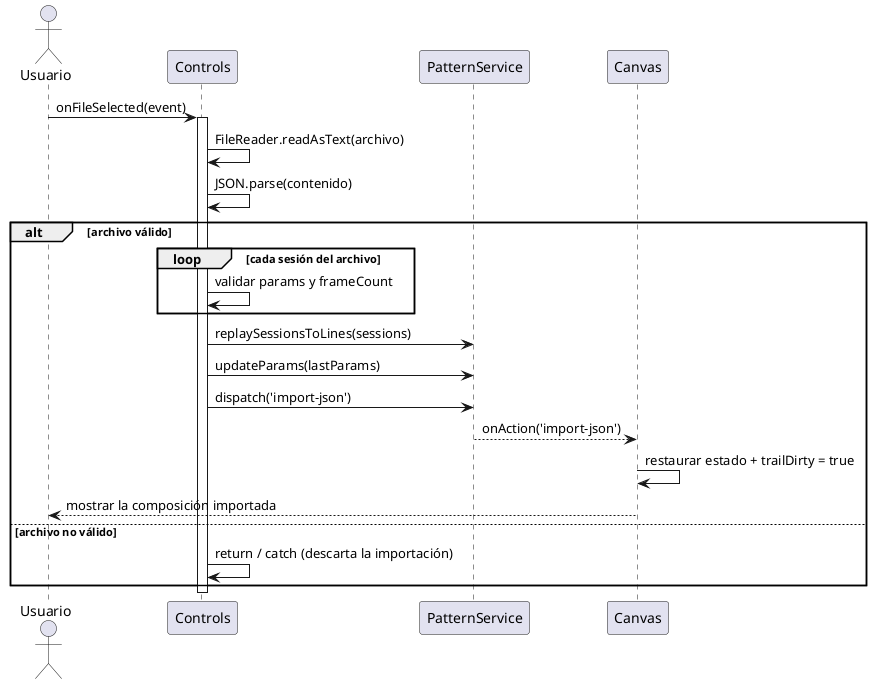
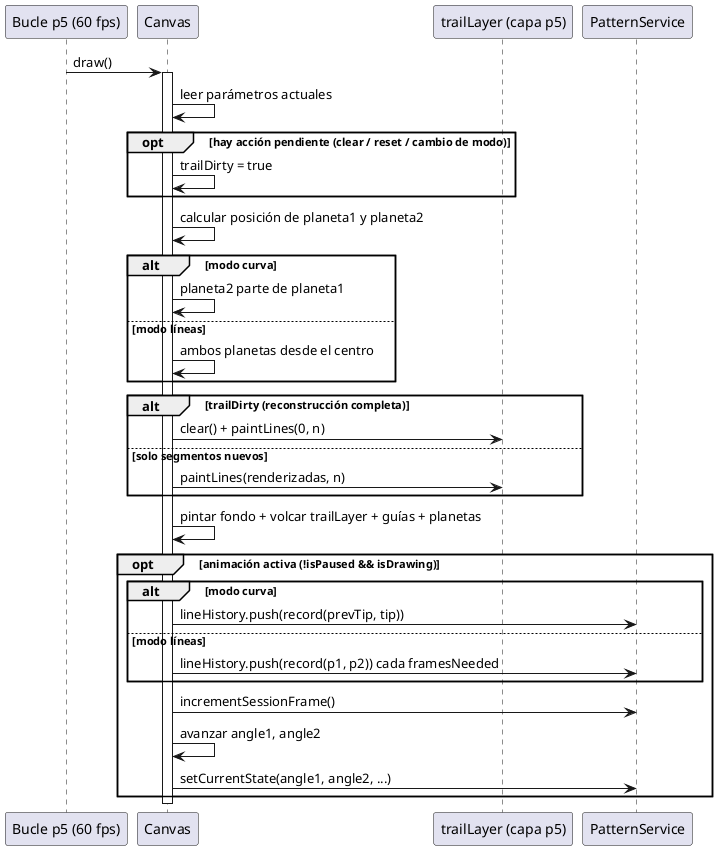
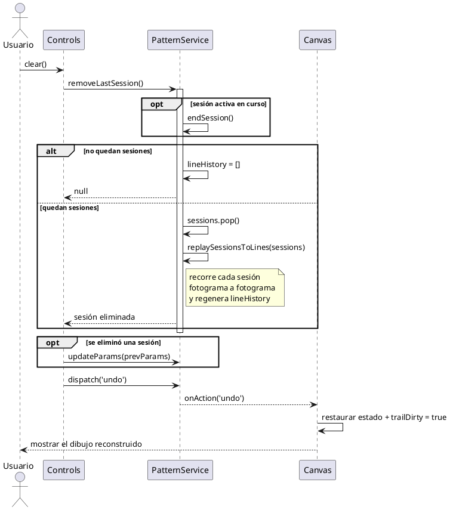
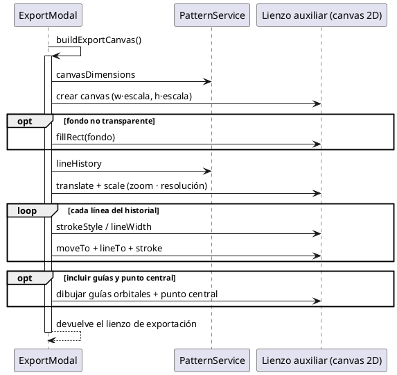
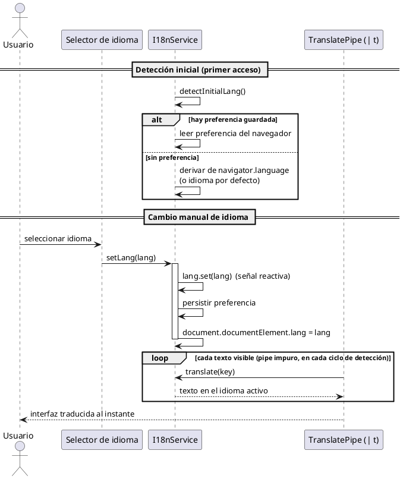

# Capítulo 5: Diseño

> Borrador del apartado de diseño de la memoria del TFG *Epicycloid Generator*.
> **Nivel de diseño**: los diagramas de secuencia detallan, con más profundidad que los del
> capítulo 4, la **colaboración entre las clases reales** del sistema en las **funciones más relevantes**
> del código. En lugar de describir una operación de principio a fin, cada diagrama profundiza en una
> **función concreta** y muestra su lógica interna y los mensajes que intercambia con el resto de clases.
> Los mensajes se expresan mediante **funciones reales** (pseudocódigo) y las líneas de vida son las
> **clases del código** (`Controls`, `Canvas`, `PatternService`, `ExportModal`), de modo que sirvan de
> base directa para la implementación. Los diagramas se han elaborado en Visual Paradigm, las
> especificaciones están en el anexo final.

---

Tras el análisis de los requisitos del proyecto y la posterior elaboración de los respectivos casos de uso, se ha diseñado la estructura que deberá seguir la aplicación durante el desarrollo.

En este apartado se presentan los diagramas de secuencia que analizan el comportamiento interno de las funciones más relevantes del sistema, detallando cómo colaboran sus distintos elementos para llevarlas a cabo. Además, se explican las decisiones visuales tomadas para la interfaz de la aplicación, priorizando la claridad, la accesibilidad y la coherencia estética.

A diferencia de la aplicación en que se inspira esta estructura, *Epicycloid Generator* es una aplicación web de página única, sin inicio de sesión ni navegación entre múltiples pantallas. Por ello, los diagramas no representan transiciones entre pantallas, sino la lógica interna de las funciones que sostienen las interacciones significativas del usuario con la única vista de la aplicación (el lienzo y el panel de control).

## 5.1. Diagramas de secuencia de las funciones principales

Los diagramas de secuencia de esta sección analizan el comportamiento dinámico del sistema a través de las **funciones más relevantes de cada una de sus clases**: en lugar de recorrer una operación completa de principio a fin, cada diagrama profundiza en una función concreta y muestra su lógica interna y los mensajes que intercambia con las demás clases para cumplir su cometido. Se ha seleccionado una función representativa por cada una de las clases principales del sistema, el panel de control (`Controls`), el lienzo (`Canvas`), el servicio coordinador (`PatternService`), el diálogo de exportación (`ExportModal`) y el servicio de internacionalización (`I18nService`), por concentrar la lógica esencial de la aplicación. Al inicio de cada apartado se indica **la clase a la que pertenece la función y un breve resumen de su cometido**. Se emplean fragmentos combinados (`loop`, `alt` y `opt`) para reflejar la repetición y la lógica condicional de cada función.

### Función `onFileSelected()`, importación de un patrón

**Clase a la que pertenece:** `Controls` (panel de control).
**Resumen de la función:** recupera una composición previamente guardada a partir de un archivo JSON, validando su estructura antes de reconstruir el dibujo y restaurar los parámetros.

Esta función representa al panel de control, cuya responsabilidad es traducir las acciones del usuario en órdenes para el resto del sistema. Recupera una composición guardada a partir de un archivo JSON (RF7), incorporando la validación de la entrada (RNF10). El diagrama muestra cómo, tras leer y parsear el archivo, un bloque `alt` distingue dos rutas. Si el archivo es válido, se comprueba que contenga sesiones y que cada una tenga sus parámetros y su número de fotogramas (`loop` de validación), reconstruye el dibujo con `replaySessionsToLines()`, actualiza los parámetros mostrados al estado del patrón cargado y ordena al lienzo que restaure ese estado. Si no lo es, la importación se descarta de forma silenciosa para no interrumpir la experiencia del usuario.

*(Aquí va la Figura 5.1: Diagrama de secuencia de la función `onFileSelected()` (clase `Controls`), ver anexo.)*

### Función `draw()`, bucle de dibujo del lienzo

**Clase a la que pertenece:** `Canvas` (lienzo de dibujo).
**Resumen de la función:** bucle que p5.js ejecuta 60 veces por segundo y en el que se genera el patrón fotograma a fotograma, concentra el cálculo geométrico y la estrategia de rendimiento.

Es la función más importante de la aplicación y la más interesante de analizar, pues en ella se materializa la generación del patrón (RF1). El diagrama detalla su recorrido en cada fotograma: primero lee los parámetros vigentes y atiende cualquier acción pendiente, limpieza, restablecimiento o cambio de modo, (`opt`), a continuación calcula la posición de los dos planetas, cuyo origen difiere según el modo de visualización (un bloque `alt` distingue el modo curva del modo líneas), después actualiza la capa de estela fuera de pantalla, repintando solo los segmentos nuevos salvo que sea necesaria una reconstrucción completa (segundo `alt`), y, por último, si la animación está activa (`opt`), registra el nuevo segmento en el historial, incrementa el contador de la sesión y avanza los ángulos para el siguiente fotograma.

*(Aquí va la Figura 5.2: Diagrama de secuencia de la función `draw()` (clase `Canvas`), ver anexo.)*

### Función `removeLastSession()`, deshacer incremental

**Clase a la que pertenece:** `PatternService` (servicio coordinador y única fuente de verdad).
**Resumen de la función:** elimina la última sesión grabada y reconstruye el dibujo con las restantes, implementando el deshacer incremental.

Esta función representa al servicio que coordina los parámetros, las sesiones y el historial de trazas. Implementa el deshacer incremental de la composición (RF5) y es un buen ejemplo de colaboración entre el panel de control, el servicio y el lienzo. Invocada desde `clear()`, comienza cerrando la sesión activa si la hubiera (`opt`). A continuación, un bloque `alt` distingue dos casos: si no quedan sesiones anteriores, vacía el historial de trazas, si quedan, retira la última y reconstruye el dibujo completo con las restantes mediante `replaySessionsToLines()`, que recorre cada sesión fotograma a fotograma regenerando los segmentos. Tras ello, el panel restaura los parámetros de la sesión previa y ordena al lienzo (`dispatch('undo')`) que reconstruya la estela y muestre el resultado. Conviene destacar que esa misma rutina de reconstrucción se reutiliza en la importación, lo que garantiza un resultado idéntico al dibujo original.

*(Aquí va la Figura 5.3: Diagrama de secuencia de la función `removeLastSession()` (clase `PatternService`), ver anexo.)*

### Función `buildExportCanvas()`, generación de la imagen de exportación

**Clase a la que pertenece:** `ExportModal` (diálogo de exportación de imagen).
**Resumen de la función:** construye, sobre un lienzo auxiliar en memoria, la imagen final de la composición a la resolución y con las opciones elegidas.

Esta función representa al diálogo de exportación. Genera la imagen final de la composición (RF6) sobre un lienzo auxiliar en memoria, independiente del lienzo principal. El diagrama detalla su construcción: crea el lienzo a la resolución elegida (las dimensiones del lienzo multiplicadas por el factor de escala), pinta el fondo solo si no se ha pedido transparente (`opt`), recorre todo el historial de líneas dibujándolas a calidad vectorial (`loop`), y, opcionalmente, superpone las guías orbitales y el punto central (`opt`), aplicando el zoom y la resolución seleccionados. La función la reutilizan tanto `renderPreview()`, para la previsualización en tiempo real, como `save()`, para la descarga del PNG, de modo que lo que el usuario ve en la vista previa coincide exactamente con el archivo obtenido.

*(Aquí va la Figura 5.4: Diagrama de secuencia de la función `buildExportCanvas()` (clase `ExportModal`), ver anexo.)*

### Función `setLang()`, cambio de idioma de la interfaz

**Clase a la que pertenece:** `I18nService` (servicio de internacionalización).
**Resumen de la función:** cambia el idioma activo de la interfaz y persiste la preferencia, logrando que todos los textos se traduzcan al instante sin recargar la página.

Esta función representa al servicio de internacionalización (RF14). El diagrama refleja tanto la detección inicial del idioma como el cambio manual. Al arrancar la aplicación, `detectInitialLang()` elige el idioma mediante un bloque `alt`: si existe una preferencia guardada del usuario, la respeta, en su defecto, deriva el idioma de la configuración del navegador o recurre al idioma por defecto. Para el cambio manual, cuando el usuario selecciona un idioma en el selector, `setLang()` actualiza la señal reactiva del idioma, guarda la preferencia y fija el atributo de idioma del documento. Como el `TranslatePipe` (`| t`) es un pipe impuro, se reevalúa en el siguiente ciclo de detección de cambios: un bloque `loop` recorre cada texto visible invocando `translate()`, de modo que toda la interfaz queda traducida de forma inmediata.

*(Aquí va la Figura 5.5: Diagrama de secuencia de la función `setLang()` (clase `I18nService`), ver anexo.)*

## 5.2. Diseño visual

### 5.2.1. Principios de diseño

El diseño visual de la aplicación influye directamente en su usabilidad y accesibilidad. Esta sección describe cómo se ha aplicado un enfoque coherente y centrado en el usuario, abordando aspectos clave como los colores, la tipografía, la distribución de los elementos y la accesibilidad, para ofrecer una interfaz clara y funcional que permita percibir de inmediato el efecto de cada ajuste sobre la composición.

**Consistencia visual**

Se ha mantenido una coherencia visual en toda la aplicación, utilizando los mismos estilos para botones, márgenes, colores y tipografías, lo que favorece una curva de aprendizaje mínima por parte del usuario. Todos los parámetros siguen el mismo patrón de control (etiqueta, deslizador y campo numérico), y las acciones se agrupan con un estilo de botón uniforme. Además, existe una correspondencia visual directa entre el panel de control y el lienzo, de modo que los elementos relacionados comparten el mismo tratamiento cromático.

**Paleta de colores**

Se ha optado por una paleta equilibrada, en la que predominan los tonos oscuros y neutros para el fondo, combinados con colores vivos para los elementos interactivos. El fondo oscuro realza los trazos luminosos del patrón, favorece la legibilidad en entornos con poca luz y reduce la fatiga visual en sesiones prolongadas. Se ha incorporado además una **codificación cromática semántica**: el azul identifica a la primera órbita y el rojo a la segunda, de forma coherente entre los controles, las guías del lienzo y los planetas, lo que permite al usuario asociar de un vistazo cada control con su elemento. Los botones de acción siguen también un código de color coherente (por ejemplo, verde para reproducir o rojo para restablecer).

**Tipografía**

La aplicación emplea la fuente *sans-serif* del sistema (la pila tipográfica por defecto del framework de estilos), sencilla y de tamaño medio, lo que facilita la lectura y ofrece un aspecto nativo en cada plataforma sin cargar fuentes externas. Se usan distintos pesos para diferenciar títulos, subtítulos y textos secundarios, la negrita se reserva para títulos y botones importantes, y los valores numéricos de los parámetros emplean una fuente monoespaciada que mantiene las cifras alineadas.

**Distribución de la interfaz**

La disposición de los elementos sigue una estructura jerárquica y lógica dentro de una única vista, dividida en dos zonas: el **lienzo** ocupa la mayor parte de la pantalla (aproximadamente el 70 %) a la izquierda, y el **panel de control** (aproximadamente el 30 %) a la derecha. Así, parámetros y resultado conviven sin necesidad de cambiar de pantalla, reforzando la edición en tiempo real. Dentro del panel, los controles se ordenan de lo general a lo específico (un desplegable de ejemplos predefinidos como punto de partida opcional, el modo de visualización, órbita 1, órbita 2, ajustes visuales y, plegados por defecto, los parámetros avanzados), y las acciones principales quedan siempre accesibles en la parte inferior. Los elementos secundarios, controles de zoom, ayuda y selector de idioma, se sitúan en esquinas, accesibles pero sin entorpecer la visualización de la composición. Este diseño minimiza el número de pasos para acceder a las funciones relevantes.

**Accesibilidad y adaptabilidad**

El diseño está optimizado para pantallas de diferentes tamaños y resoluciones: el lienzo se redimensiona con la ventana del navegador y el panel se adapta a resoluciones de escritorio y tableta. Se respetan principios de accesibilidad como el contraste adecuado entre el texto y el fondo, las etiquetas descriptivas en los controles y el reflejo del idioma activo en el documento. Asimismo, la validación automática de los valores introducidos y el bloqueo de los controles durante la animación evitan estados inconsistentes, y un tutorial de bienvenida, mostrado en el primer acceso y reabrible en cualquier momento, facilita el uso a personas sin conocimientos previos. El soporte multilingüe contribuye también a que la aplicación sea accesible a un público más amplio.

### 5.2.2. Mockups

Se presentan las principales vistas de la aplicación, con el objetivo de mostrar cómo se ha plasmado gráficamente la experiencia de usuario planteada durante las fases de diseño. Los mockups se han elaborado con la herramienta de diseño en línea Figma. Entre las vistas representadas destacan: la vista principal con el lienzo y el panel de control, el panel con sus secciones de parámetros (incluida la de parámetros avanzados desplegada), el desplegable de ejemplos predefinidos, el diálogo de exportación de imagen con su previsualización y opciones, el tutorial de bienvenida, y el selector de idioma desplegado.

*(Aquí van las Figuras 5.5 y siguientes: capturas/mockups de las vistas de la aplicación.)*

---

# Anexo, Construcción de los diagramas de secuencia (Capítulo 5) en Visual Paradigm

> Especificación de cada diagrama de secuencia de diseño. Las líneas de vida son las **clases reales**
> del código y los mensajes son **funciones reales** (pseudocódigo). Para las respuestas se usa
> **mensaje de retorno** (flecha discontinua), para la lógica condicional, **Combined Fragment** de
> tipo `loop`, `alt` u `opt` según se indique.
>
> **Pasos generales en Visual Paradigm:** `File → New → Sequence Diagram`. Coloca las líneas de vida
> (un **Actor** `Usuario` y las **clases** indicadas en cada figura) y traza los **Message** etiquetados
> con el nombre de la función. Para los fragmentos, selecciona los mensajes implicados y `right-click →
> Enclose with → Combined Fragment`, eligiendo el tipo (`loop` / `alt` / `opt`) y escribiendo la condición.

## A.1. Figura 5.1: Función `onFileSelected()` · clase `Controls` (importación de un patrón)

**Líneas de vida:** `Usuario`, `Controls`, `PatternService`, `Canvas`.

## A.2. Figura 5.2: Función `draw()` · clase `Canvas` (bucle de dibujo del lienzo)

**Líneas de vida:** `Bucle p5 (60 fps)`, `Canvas`, `trailLayer (capa p5)`, `PatternService`.

## A.3. Figura 5.3: Función `removeLastSession()` · clase `PatternService` (deshacer incremental)

**Líneas de vida:** `Usuario`, `Controls`, `PatternService`, `Canvas`.

## A.4. Figura 5.4: Función `buildExportCanvas()` · clase `ExportModal` (generación de la imagen)

**Líneas de vida:** `ExportModal`, `PatternService`, `Lienzo auxiliar (canvas 2D)`.

## A.5. Figura 5.5: Función `setLang()` · clase `I18nService` (cambio de idioma de la interfaz)

**Líneas de vida:** `Usuario`, `Selector de idioma`, `I18nService`, `TranslatePipe (| t)`.

