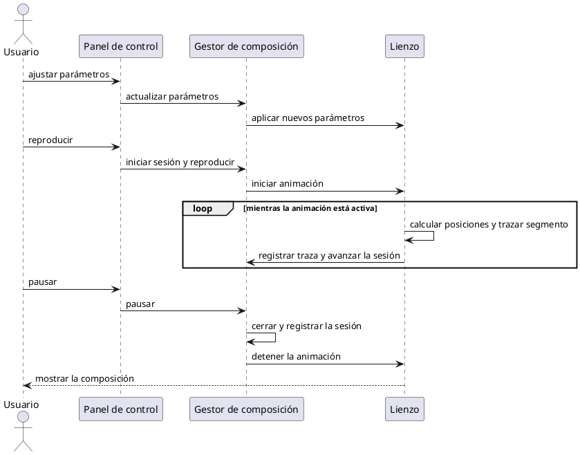
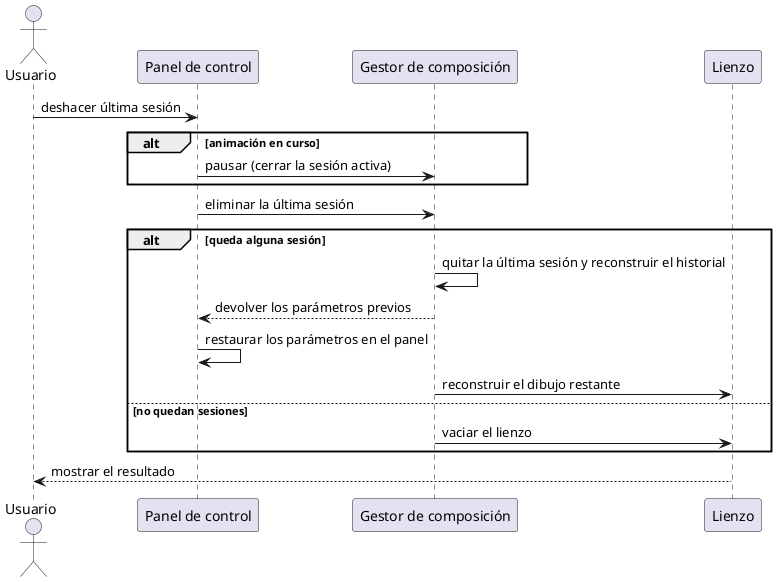
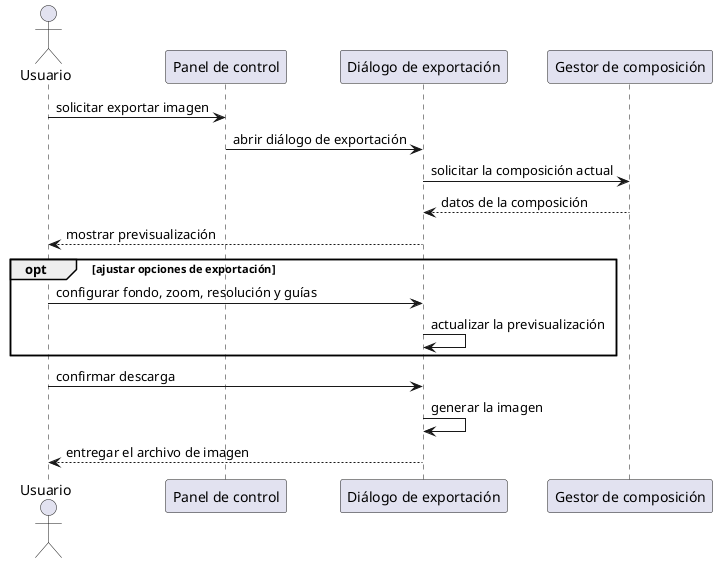
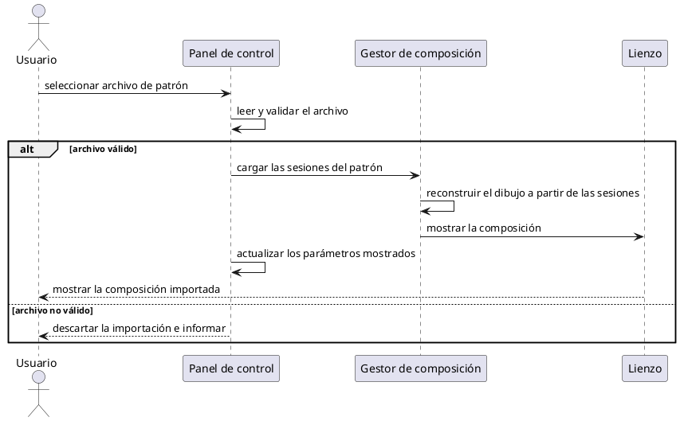
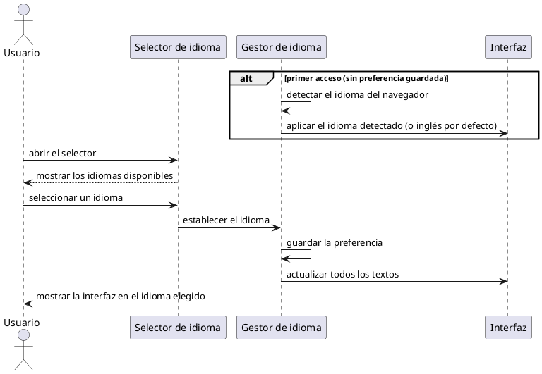

# Capítulo 5 — Diseño

> Borrador del apartado de diseño de la memoria del TFG *Epicycloid Generator*.
> **Nivel de diseño**: a diferencia del análisis (donde el sistema se trataba como una caja negra),
> aquí los diagramas de secuencia muestran la **colaboración entre los elementos internos** del
> sistema. No obstante, se mantienen en un plano **conceptual**: los participantes son los
> componentes lógicos de la aplicación (panel de control, lienzo, gestor de composición, gestor de
> idioma…), sin nombrar funciones reales ni tecnologías de implementación. Los diagramas se han
> elaborado en Visual Paradigm; las especificaciones para reproducirlos están en el anexo final.

---

Tras el análisis de los requisitos del proyecto y la posterior elaboración de los respectivos casos de uso, se ha diseñado la estructura que deberá seguir la aplicación durante el desarrollo.

En este apartado se presentan los diagramas de secuencia que describen el flujo de las operaciones clave del sistema, detallando cómo colaboran sus distintos elementos para llevarlas a cabo. Además, se explican las decisiones visuales tomadas para la interfaz de la aplicación, priorizando la claridad, la accesibilidad y la coherencia estética.

A diferencia de la aplicación en que se inspira esta estructura, *Epicycloid Generator* es una aplicación web de página única, sin inicio de sesión ni navegación entre múltiples pantallas. Por ello, las operaciones representadas no corresponden a transiciones entre pantallas, sino a las interacciones significativas del usuario con la única vista de la aplicación (el lienzo y el panel de control).

## 5.1. Diagramas de secuencia de operaciones del sistema

Los diagramas de secuencia de esta sección describen el comportamiento dinámico del sistema durante las operaciones más relevantes. Para ello se identifican los siguientes **participantes** conceptuales, que representan los elementos lógicos que colaboran en cada operación:

- **Usuario:** actor que interactúa con la aplicación.
- **Panel de control:** la zona de la interfaz donde el usuario ajusta parámetros y lanza acciones.
- **Lienzo:** la superficie donde se dibuja y anima la composición.
- **Gestor de composición:** el elemento que coordina el estado del patrón, las sesiones de animación y el historial de trazas.
- **Diálogo de exportación:** la ventana que reúne las opciones para guardar la composición como imagen.
- **Selector de idioma** y **Gestor de idioma:** los elementos encargados, respectivamente, de ofrecer los idiomas disponibles y de aplicar y recordar el idioma activo.

Se emplean fragmentos combinados —`loop` (repetición), `alt` (alternativa) y `opt` (opcional)— para reflejar la lógica condicional de cada operación.

### Diagrama de secuencia de la operación «Generar y reproducir el patrón»

Este diagrama representa la operación central de la aplicación. El usuario ajusta los parámetros en el panel de control, que los traslada al gestor de composición; este, a su vez, notifica al lienzo para que refleje los cambios. Cuando el usuario reproduce la animación, el gestor inicia una nueva sesión y el lienzo entra en un ciclo (`loop`) en el que, fotograma a fotograma, calcula las posiciones y acumula las trazas resultantes, informando al gestor para el registro de la sesión. Al pausar, el gestor cierra la sesión (la registra como un bloque) y el lienzo detiene la animación, conservando la composición.

*(Aquí va la Figura 5.1: Diagrama de secuencia «Generar y reproducir el patrón» — ver anexo.)*

### Diagrama de secuencia de la operación «Deshacer última sesión»

Este diagrama ilustra el comportamiento del deshacer incremental. Cuando el usuario solicita deshacer, un primer fragmento `alt` contempla que, si hay una animación en curso, el sistema la detiene primero y la considera la sesión a eliminar. A continuación, un segundo fragmento `alt` distingue dos casos: si queda alguna sesión, el gestor de composición retira la última, reconstruye el historial con las restantes, devuelve los parámetros previos al panel de control —que los restaura en la interfaz— y ordena al lienzo reconstruir el dibujo restante; si no queda ninguna, el lienzo simplemente se vacía. Así, cada pulsación retira un bloque más y devuelve la aplicación al estado anterior a esa sesión.

*(Aquí va la Figura 5.2: Diagrama de secuencia «Deshacer última sesión» — ver anexo.)*

### Diagrama de secuencia de la operación «Exportar imagen»

Este diagrama describe el guardado de la composición como imagen. El usuario solicita la exportación desde el panel de control, que abre el diálogo de exportación; este pide al gestor de composición los datos de la composición actual y muestra una previsualización. Un fragmento `opt` recoge que el usuario puede, opcionalmente, ajustar las opciones de exportación (fondo o transparencia, zoom, resolución y visibilidad de las guías), lo que actualiza la previsualización. Finalmente, el usuario confirma la descarga y el diálogo genera y entrega el archivo de imagen.

*(Aquí va la Figura 5.3: Diagrama de secuencia «Exportar imagen» — ver anexo.)*

### Diagrama de secuencia de la operación «Importar patrón»

Este diagrama representa la recuperación de una composición previamente guardada. El usuario selecciona un archivo de patrón en el panel de control, que lo lee y valida. Un fragmento `alt` distingue dos rutas: si el archivo es válido, el gestor de composición carga las sesiones, reconstruye el dibujo a partir de ellas y lo muestra en el lienzo, y el panel de control actualiza los parámetros mostrados al estado del patrón cargado; si el archivo no es válido, el sistema descarta la importación e informa al usuario.

*(Aquí va la Figura 5.4: Diagrama de secuencia «Importar patrón» — ver anexo.)*

### Diagrama de secuencia de la operación «Cambiar idioma»

Este diagrama refleja tanto la detección automática como el cambio manual de idioma. Un fragmento `alt` contempla, en el primer acceso, que el gestor de idioma detecta el idioma del navegador y aplica el correspondiente a la interfaz (o el inglés por defecto si no está disponible). Para el cambio manual, el usuario abre el selector de idioma, que muestra los idiomas disponibles; al elegir uno, el gestor de idioma guarda la preferencia y actualiza de inmediato todos los textos de la interfaz, sin recargar la página.

*(Aquí va la Figura 5.5: Diagrama de secuencia «Cambiar idioma» — ver anexo.)*

## 5.2. Diseño visual

### 5.2.1. Principios de diseño

El diseño visual de la aplicación influye directamente en su usabilidad y accesibilidad. Esta sección describe cómo se ha aplicado un enfoque coherente y centrado en el usuario, abordando aspectos clave como los colores, la tipografía, la distribución de los elementos y la accesibilidad, para ofrecer una interfaz clara y funcional que permita percibir de inmediato el efecto de cada ajuste sobre la composición.

**Consistencia visual**

Se ha mantenido una coherencia visual en toda la aplicación, utilizando los mismos estilos para botones, márgenes, colores y tipografías, lo que favorece una curva de aprendizaje mínima por parte del usuario. Todos los parámetros siguen el mismo patrón de control (etiqueta, deslizador y campo numérico), y las acciones se agrupan con un estilo de botón uniforme. Además, existe una correspondencia visual directa entre el panel de control y el lienzo, de modo que los elementos relacionados comparten el mismo tratamiento cromático.

**Paleta de colores**

Se ha optado por una paleta equilibrada, en la que predominan los tonos oscuros y neutros para el fondo, combinados con colores vivos para los elementos interactivos. El fondo oscuro realza los trazos luminosos del patrón, favorece la legibilidad en entornos con poca luz y reduce la fatiga visual en sesiones prolongadas. Se ha incorporado además una **codificación cromática semántica**: el azul identifica a la primera órbita y el rojo a la segunda, de forma coherente entre los controles, las guías del lienzo y los planetas, lo que permite al usuario asociar de un vistazo cada control con su elemento. Los botones de acción siguen también un código de color coherente (por ejemplo, verde para reproducir o rojo para restablecer).

**Tipografía**

La fuente utilizada es de tipo *sans-serif*, sencilla y de tamaño medio, lo que facilita la lectura rápida y evita la fatiga visual. Se emplean distintos pesos para diferenciar títulos, subtítulos y textos secundarios: la negrita se reserva para títulos y botones importantes, con el fin de guiar la atención del usuario, mientras que los textos de ayuda y las descripciones auxiliares utilizan un tamaño menor y un tono más tenue.

**Distribución de la interfaz**

La disposición de los elementos sigue una estructura jerárquica y lógica dentro de una única vista, dividida en dos zonas: el **lienzo** ocupa la mayor parte de la pantalla (aproximadamente el 70 %) a la izquierda, y el **panel de control** (aproximadamente el 30 %) a la derecha. Así, parámetros y resultado conviven sin necesidad de cambiar de pantalla, reforzando la edición en tiempo real. Dentro del panel, los controles se ordenan de lo general a lo específico (modo de visualización, órbita 1, órbita 2, ajustes visuales y, plegados por defecto, los parámetros avanzados), y las acciones principales quedan siempre accesibles en la parte inferior. Los elementos secundarios —controles de zoom, ayuda y selector de idioma— se sitúan en esquinas, accesibles pero sin entorpecer la visualización de la composición. Este diseño minimiza el número de pasos para acceder a las funciones relevantes.

**Accesibilidad y adaptabilidad**

El diseño está optimizado para pantallas de diferentes tamaños y resoluciones: el lienzo se redimensiona con la ventana del navegador y el panel se adapta a resoluciones de escritorio y tableta. Se respetan principios de accesibilidad como el contraste adecuado entre el texto y el fondo, las etiquetas descriptivas en los controles y el reflejo del idioma activo en el documento. Asimismo, la validación automática de los valores introducidos y el bloqueo de los controles durante la animación evitan estados inconsistentes, y un tutorial de bienvenida —mostrado en el primer acceso y reabrible en cualquier momento— facilita el uso a personas sin conocimientos previos. El soporte multilingüe contribuye también a que la aplicación sea accesible a un público más amplio.

### 5.2.2. Mockups

Se presentan las principales vistas de la aplicación, con el objetivo de mostrar cómo se ha plasmado gráficamente la experiencia de usuario planteada durante las fases de diseño. Entre ellas destacan: la vista principal con el lienzo y el panel de control; el panel con sus secciones de parámetros (incluida la de parámetros avanzados desplegada); el diálogo de exportación de imagen con su previsualización y opciones; el tutorial de bienvenida; y el selector de idioma desplegado.

*(Aquí van las Figuras 5.6 y siguientes: capturas/mockups de las vistas de la aplicación.)*

---

# Anexo — Construcción de los diagramas de secuencia (Capítulo 5) en Visual Paradigm

> Especificación conceptual de cada diagrama de secuencia de diseño. Los participantes son elementos
> lógicos del sistema (no componentes de software concretos ni tecnologías). Para las respuestas se
> usa **mensaje de retorno** (flecha discontinua); para la lógica condicional, **Combined Fragment**
> de tipo `loop`, `alt` u `opt` según se indique.
>
> **Pasos generales en Visual Paradigm:** `File → New → Sequence Diagram`. Coloca las líneas de vida
> (un **Actor** `Usuario` y los **participantes** indicados en cada figura) y traza los **Message** en
> el orden descrito. Para los fragmentos, selecciona los mensajes implicados y `right-click → Enclose
> with → Combined Fragment`, eligiendo el tipo (`loop` / `alt` / `opt`) y escribiendo la condición.

## A.1. Figura 5.1 — «Generar y reproducir el patrón»

**Participantes:** `Usuario`, `Panel de control`, `Gestor de composición`, `Lienzo`.

## A.2. Figura 5.2 — «Deshacer última sesión»

**Participantes:** `Usuario`, `Panel de control`, `Gestor de composición`, `Lienzo`.

## A.3. Figura 5.3 — «Exportar imagen»

**Participantes:** `Usuario`, `Panel de control`, `Diálogo de exportación`, `Gestor de composición`.

## A.4. Figura 5.4 — «Importar patrón»

**Participantes:** `Usuario`, `Panel de control`, `Gestor de composición`, `Lienzo`.

## A.5. Figura 5.5 — «Cambiar idioma»

**Participantes:** `Usuario`, `Selector de idioma`, `Gestor de idioma`, `Interfaz`.

