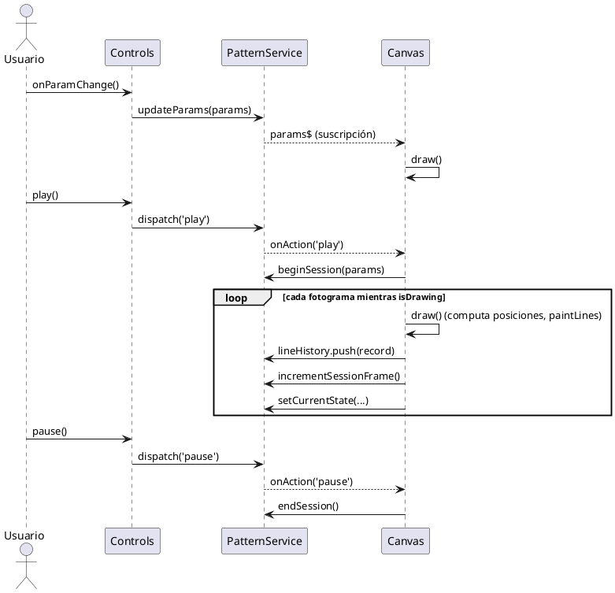
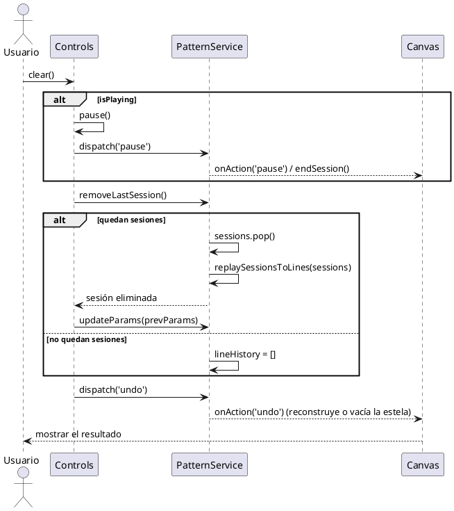
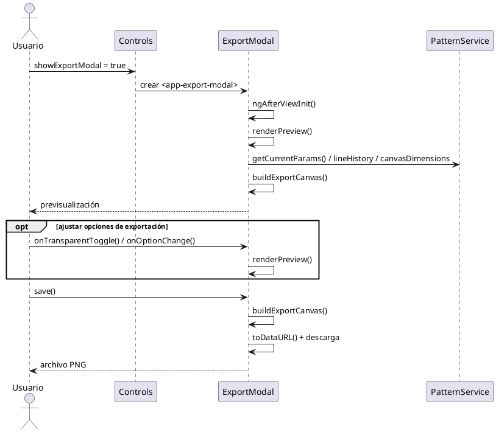
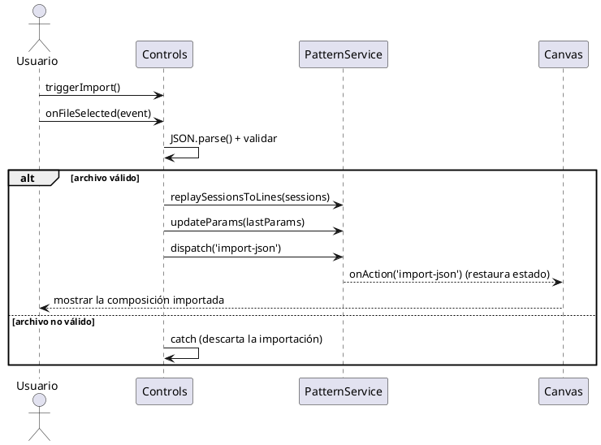
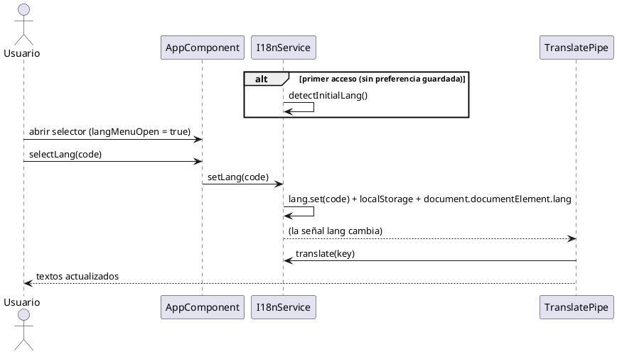

# Capítulo 5 — Diseño

> Borrador del apartado de diseño de la memoria del TFG *Epicycloid Generator*.
> **Nivel de diseño**: los diagramas de secuencia detallan, con más profundidad que los del
> capítulo 4, la **colaboración entre las clases reales** del sistema durante las operaciones clave.
> Los mensajes se expresan mediante **funciones reales** (pseudocódigo) y las líneas de vida son las
> **clases del código** (`Controls`, `Canvas`, `PatternService`, `ExportModal`, `AppComponent`,
> `I18nService`, `TranslatePipe`), de modo que sirvan de base directa para la implementación. Los
> diagramas se han elaborado en Visual Paradigm; las especificaciones están en el anexo final.

---

Tras el análisis de los requisitos del proyecto y la posterior elaboración de los respectivos casos de uso, se ha diseñado la estructura que deberá seguir la aplicación durante el desarrollo.

En este apartado se presentan los diagramas de secuencia que describen el flujo de las operaciones clave del sistema, detallando cómo colaboran sus distintos elementos para llevarlas a cabo. Además, se explican las decisiones visuales tomadas para la interfaz de la aplicación, priorizando la claridad, la accesibilidad y la coherencia estética.

A diferencia de la aplicación en que se inspira esta estructura, *Epicycloid Generator* es una aplicación web de página única, sin inicio de sesión ni navegación entre múltiples pantallas. Por ello, las operaciones representadas no corresponden a transiciones entre pantallas, sino a las interacciones significativas del usuario con la única vista de la aplicación (el lienzo y el panel de control).

## 5.1. Diagramas de secuencia de operaciones del sistema

Los diagramas de secuencia de esta sección describen el comportamiento dinámico del sistema durante sus operaciones más relevantes. En ellos intervienen el usuario y los componentes que colaboran en cada operación —principalmente el panel de control, el lienzo y el servicio que coordina los parámetros, las sesiones y el historial de trazas, además del diálogo de exportación y los elementos encargados del idioma—. Se emplean fragmentos combinados (`loop`, `alt` y `opt`) para reflejar la repetición y la lógica condicional de cada flujo.

### Diagrama de secuencia de la operación «Generar y reproducir el patrón»

Este diagrama representa la operación central de la aplicación. El usuario ajusta los parámetros en el panel de control y el sistema actualiza al instante la representación en el lienzo. Al reproducir, el sistema inicia una sesión de animación y, mediante un bucle (`loop`), dibuja la composición fotograma a fotograma acumulando las trazas resultantes. Cuando el usuario pausa, el sistema cierra la sesión y la registra como un bloque, conservando el dibujo acumulado.

*(Aquí va la Figura 5.1: Diagrama de secuencia «Generar y reproducir el patrón» — ver anexo.)*

### Diagrama de secuencia de la operación «Deshacer última sesión»

Este diagrama ilustra el deshacer incremental de la composición. Al solicitar deshacer, un primer bloque condicional (`alt`) contempla que, si hay una animación en curso, el sistema la pausa primero para tomarla como la sesión a eliminar. A continuación, un segundo bloque alternativo distingue dos casos: si quedan sesiones anteriores, el sistema retira la última, reconstruye el dibujo con las restantes y restaura los parámetros previos; si no queda ninguna, el lienzo se vacía. En ambos casos, la estela se actualiza para reflejar el resultado.

*(Aquí va la Figura 5.2: Diagrama de secuencia «Deshacer última sesión» — ver anexo.)*

### Diagrama de secuencia de la operación «Exportar imagen»

Este diagrama describe el guardado de la composición como imagen. El usuario abre el diálogo de exportación y el sistema genera una previsualización a partir de la composición actual. Un bloque opcional (`opt`) recoge el ajuste de las opciones de exportación —fondo, zoom, resolución y elementos visibles—, que actualizan la previsualización. Al confirmar, el sistema genera la imagen final y la descarga.

*(Aquí va la Figura 5.3: Diagrama de secuencia «Exportar imagen» — ver anexo.)*

### Diagrama de secuencia de la operación «Importar patrón»

Este diagrama representa la recuperación de una composición guardada. El usuario selecciona un archivo, que el sistema lee y valida. Un bloque condicional (`alt`) distingue dos rutas: si el archivo es válido, el sistema reconstruye el dibujo y actualiza los parámetros mostrados al estado del patrón cargado; si no lo es, la importación se descarta.

*(Aquí va la Figura 5.4: Diagrama de secuencia «Importar patrón» — ver anexo.)*

### Diagrama de secuencia de la operación «Cambiar idioma»

Este diagrama refleja la detección automática y el cambio manual de idioma. Un bloque condicional (`alt`) contempla que, en el primer acceso, el sistema detecta el idioma del navegador. Para el cambio manual, el usuario abre el selector y elige un idioma; el sistema actualiza de inmediato todos los textos de la interfaz y recuerda la preferencia para futuras visitas, sin recargar la página.

*(Aquí va la Figura 5.5: Diagrama de secuencia «Cambiar idioma» — ver anexo.)*

## 5.2. Diseño visual

### 5.2.1. Principios de diseño

El diseño visual de la aplicación influye directamente en su usabilidad y accesibilidad. Esta sección describe cómo se ha aplicado un enfoque coherente y centrado en el usuario, abordando aspectos clave como los colores, la tipografía, la distribución de los elementos y la accesibilidad, para ofrecer una interfaz clara y funcional que permita percibir de inmediato el efecto de cada ajuste sobre la composición.

**Consistencia visual**

Se ha mantenido una coherencia visual en toda la aplicación, utilizando los mismos estilos para botones, márgenes, colores y tipografías, lo que favorece una curva de aprendizaje mínima por parte del usuario. Todos los parámetros siguen el mismo patrón de control (etiqueta, deslizador y campo numérico), y las acciones se agrupan con un estilo de botón uniforme. Además, existe una correspondencia visual directa entre el panel de control y el lienzo, de modo que los elementos relacionados comparten el mismo tratamiento cromático.

**Paleta de colores**

Se ha optado por una paleta equilibrada, en la que predominan los tonos oscuros y neutros para el fondo, combinados con colores vivos para los elementos interactivos. El fondo oscuro realza los trazos luminosos del patrón, favorece la legibilidad en entornos con poca luz y reduce la fatiga visual en sesiones prolongadas. Se ha incorporado además una **codificación cromática semántica**: el azul identifica a la primera órbita y el rojo a la segunda, de forma coherente entre los controles, las guías del lienzo y los planetas, lo que permite al usuario asociar de un vistazo cada control con su elemento. Los botones de acción siguen también un código de color coherente (por ejemplo, verde para reproducir o rojo para restablecer).

**Tipografía**

La aplicación emplea la fuente *sans-serif* del sistema (la pila tipográfica por defecto del framework de estilos), sencilla y de tamaño medio, lo que facilita la lectura y ofrece un aspecto nativo en cada plataforma sin cargar fuentes externas. Se usan distintos pesos para diferenciar títulos, subtítulos y textos secundarios —la negrita se reserva para títulos y botones importantes—, y los valores numéricos de los parámetros emplean una fuente monoespaciada que mantiene las cifras alineadas.

**Distribución de la interfaz**

La disposición de los elementos sigue una estructura jerárquica y lógica dentro de una única vista, dividida en dos zonas: el **lienzo** ocupa la mayor parte de la pantalla (aproximadamente el 70 %) a la izquierda, y el **panel de control** (aproximadamente el 30 %) a la derecha. Así, parámetros y resultado conviven sin necesidad de cambiar de pantalla, reforzando la edición en tiempo real. Dentro del panel, los controles se ordenan de lo general a lo específico (un desplegable de ejemplos predefinidos como punto de partida opcional, el modo de visualización, órbita 1, órbita 2, ajustes visuales y, plegados por defecto, los parámetros avanzados), y las acciones principales quedan siempre accesibles en la parte inferior. Los elementos secundarios —controles de zoom, ayuda y selector de idioma— se sitúan en esquinas, accesibles pero sin entorpecer la visualización de la composición. Este diseño minimiza el número de pasos para acceder a las funciones relevantes.

**Accesibilidad y adaptabilidad**

El diseño está optimizado para pantallas de diferentes tamaños y resoluciones: el lienzo se redimensiona con la ventana del navegador y el panel se adapta a resoluciones de escritorio y tableta. Se respetan principios de accesibilidad como el contraste adecuado entre el texto y el fondo, las etiquetas descriptivas en los controles y el reflejo del idioma activo en el documento. Asimismo, la validación automática de los valores introducidos y el bloqueo de los controles durante la animación evitan estados inconsistentes, y un tutorial de bienvenida —mostrado en el primer acceso y reabrible en cualquier momento— facilita el uso a personas sin conocimientos previos. El soporte multilingüe contribuye también a que la aplicación sea accesible a un público más amplio.

### 5.2.2. Mockups

Se presentan las principales vistas de la aplicación, con el objetivo de mostrar cómo se ha plasmado gráficamente la experiencia de usuario planteada durante las fases de diseño. Entre ellas destacan: la vista principal con el lienzo y el panel de control; el panel con sus secciones de parámetros (incluida la de parámetros avanzados desplegada); el desplegable de ejemplos predefinidos; el diálogo de exportación de imagen con su previsualización y opciones; el tutorial de bienvenida; y el selector de idioma desplegado.

*(Aquí van las Figuras 5.6 y siguientes: capturas/mockups de las vistas de la aplicación.)*

---

# Anexo — Construcción de los diagramas de secuencia (Capítulo 5) en Visual Paradigm

> Especificación de cada diagrama de secuencia de diseño. Las líneas de vida son las **clases reales**
> del código y los mensajes son **funciones reales** (pseudocódigo). Para las respuestas se usa
> **mensaje de retorno** (flecha discontinua); para la lógica condicional, **Combined Fragment** de
> tipo `loop`, `alt` u `opt` según se indique.
>
> **Pasos generales en Visual Paradigm:** `File → New → Sequence Diagram`. Coloca las líneas de vida
> (un **Actor** `Usuario` y las **clases** indicadas en cada figura) y traza los **Message** etiquetados
> con el nombre de la función. Para los fragmentos, selecciona los mensajes implicados y `right-click →
> Enclose with → Combined Fragment`, eligiendo el tipo (`loop` / `alt` / `opt`) y escribiendo la condición.

## A.1. Figura 5.1 — «Generar y reproducir el patrón»

**Líneas de vida:** `Usuario`, `Controls`, `PatternService`, `Canvas`.

## A.2. Figura 5.2 — «Deshacer última sesión»

**Líneas de vida:** `Usuario`, `Controls`, `PatternService`, `Canvas`.

## A.3. Figura 5.3 — «Exportar imagen»

**Líneas de vida:** `Usuario`, `Controls`, `ExportModal`, `PatternService`.

## A.4. Figura 5.4 — «Importar patrón»

**Líneas de vida:** `Usuario`, `Controls`, `PatternService`, `Canvas`.

## A.5. Figura 5.5 — «Cambiar idioma»

**Líneas de vida:** `Usuario`, `AppComponent`, `I18nService`, `TranslatePipe`.

