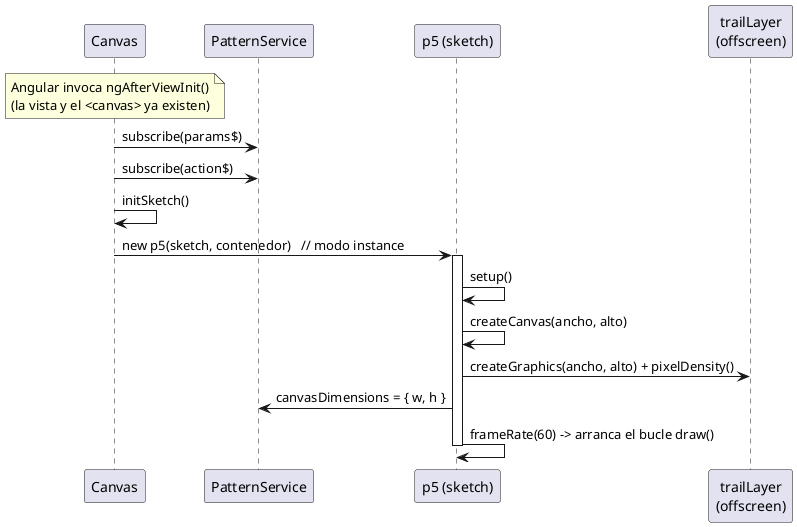
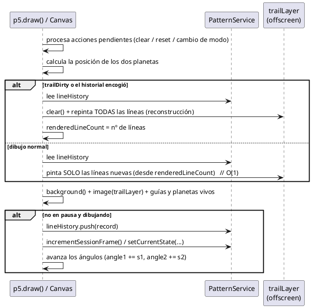
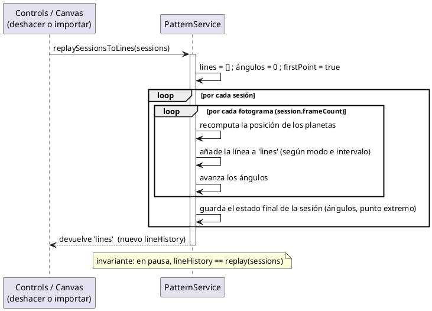
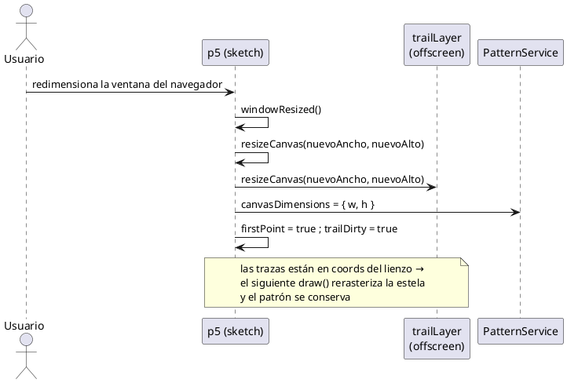
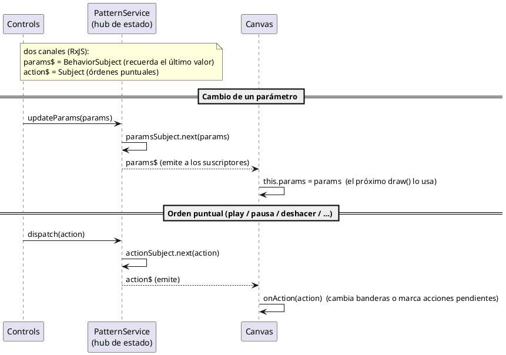

# Capítulo 5 — Diseño

> Borrador del apartado de diseño de la memoria del TFG *Epicycloid Generator*.
> **Nivel de diseño**: los diagramas de secuencia detallan, con más profundidad que los del
> capítulo 4, la **colaboración entre las clases reales** del sistema durante las operaciones clave.
> Los mensajes se expresan mediante **funciones reales** (pseudocódigo) y las líneas de vida son las
> **clases del código** (`Controls`, `Canvas`, `PatternService`, `ExportModal`, `AppComponent`,
> `I18nService`, `TranslatePipe`), de modo que sirvan de base directa para la implementación. Los
> diagramas se han elaborado en Visual Paradigm; las especificaciones están en el anexo final.

---

Tras el análisis de los requisitos del proyecto y la posterior elaboración de los respectivos casos de uso, se ha diseñado la estructura que deberá seguir la aplicación durante el desarrollo.

En este apartado se presentan los diagramas de secuencia que describen el **funcionamiento interno** del sistema, detallando cómo colaboran sus componentes y servicios para llevar a cabo las operaciones de diseño que sostienen la aplicación; de este modo complementan, con la perspectiva del diseño, las operaciones de usuario ya analizadas en el capítulo 4. Además, se explican las decisiones visuales tomadas para la interfaz de la aplicación, priorizando la claridad, la accesibilidad y la coherencia estética.

A diferencia de la aplicación en que se inspira esta estructura, *Epicycloid Generator* es una aplicación web de página única, sin inicio de sesión ni navegación entre múltiples pantallas. Por ello, las operaciones representadas no corresponden a transiciones entre pantallas, sino a los **mecanismos internos del motor de dibujo** y a la colaboración entre los componentes dentro de la única vista de la aplicación (el lienzo y el panel de control).

## 5.1. Diagramas de secuencia de operaciones del sistema

A diferencia del capítulo 4 —que modela las **operaciones del usuario** (los casos de uso)—, esta sección detalla el **funcionamiento interno** del sistema: cómo colaboran las clases reales para llevar a cabo las **operaciones de diseño** que sostienen la aplicación y que no son acciones directas del usuario, sino mecanismos internos del motor de dibujo. Así se evita repetir lo ya mostrado en el análisis y se aporta la perspectiva propia del diseño.

Las operaciones internas representadas son: la **inicialización del lienzo**, el **renderizado de un fotograma**, la **reconstrucción del historial de trazas**, el **redimensionado responsivo** y la **comunicación reactiva entre componentes**. Las líneas de vida son las clases reales del código —`Canvas`, `PatternService`, `Controls`— junto con la instancia de **p5** y su **capa de estela** (`trailLayer`). Se emplean fragmentos combinados (`loop`, `alt`) para reflejar la repetición y la lógica condicional.

### Diagrama de secuencia de la operación «Inicialización del lienzo»

Ocurre al crearse el componente del lienzo. Una vez que Angular ha renderizado la vista (en el hook `ngAfterViewInit`), `Canvas` se **suscribe** a los dos canales del servicio (parámetros y órdenes) y crea la instancia de **p5** en modo *instance* sobre el contenedor del DOM. En su arranque (`setup`), p5 crea el lienzo principal y una **capa de estela fuera de pantalla** del mismo tamaño, guarda las dimensiones en el servicio y pone en marcha el bucle de dibujo a 60 fps. Es la operación que conecta el ciclo de vida de Angular con el motor gráfico (ver [10 — Ciclo de vida](../estructura/10-ciclo-de-vida-angular.md)).

*(Aquí va la Figura 5.1: Diagrama de secuencia «Inicialización del lienzo» — ver anexo.)*

### Diagrama de secuencia de la operación «Renderizado de un fotograma»

Es la operación que más se repite (60 veces por segundo) y el núcleo del rendimiento. En cada fotograma, el lienzo atiende primero las **acciones pendientes** (limpiar, reiniciar o cambio de modo); después decide cómo pintar la estela mediante un bloque alternativo (`alt`): si algo obligó a rehacerla —zoom, redimensionado, importación…— la **reconstruye entera**; si no, pinta **solo las líneas nuevas** desde el último fotograma (coste O(1)). Luego compone el fotograma (fondo + capa de estela + guías y planetas vivos) y, si la animación está activa, añade la nueva traza al historial y avanza los ángulos. Aquí reside la clave de **RNF5/RNF8** (ver [05 — Renderizado](../estructura/05-renderizado-rendimiento.md)).

*(Aquí va la Figura 5.2: Diagrama de secuencia «Renderizado de un fotograma» — ver anexo.)*

### Diagrama de secuencia de la operación «Reconstrucción del historial de trazas»

Es el algoritmo interno que sostiene tanto el **deshacer** como la **importación** de patrones. A partir de una lista de sesiones, el servicio **reproduce la simulación** de cada bloque fotograma a fotograma (dos bucles `loop` anidados: por sesión y por fotograma), recomputando todas las líneas y el estado final de cada sesión. El resultado es el nuevo historial de trazas. Sobre esta operación descansa el **invariante** del sistema: en pausa, el historial equivale exactamente al *replay* de las sesiones.

*(Aquí va la Figura 5.3: Diagrama de secuencia «Reconstrucción del historial de trazas» — ver anexo.)*

### Diagrama de secuencia de la operación «Redimensionado responsivo del lienzo»

Cuando cambia el tamaño de la ventana, p5 invoca `windowResized`. El lienzo principal y la capa de estela se **redimensionan** a las nuevas medidas, se actualizan las dimensiones guardadas en el servicio y se marca la estela para rehacerse. Como las trazas se guardan en **coordenadas del lienzo**, el patrón **se conserva**: en el siguiente fotograma se rerasteriza por completo al nuevo tamaño. Esta operación es la que materializa la visualización responsiva (**RF11/RNF9**).

*(Aquí va la Figura 5.4: Diagrama de secuencia «Redimensionado responsivo del lienzo» — ver anexo.)*

### Diagrama de secuencia de la operación «Comunicación reactiva entre componentes»

Describe la **columna vertebral de la arquitectura**: cómo se comunican los componentes sin conocerse entre sí, a través del servicio `PatternService`. Este expone dos canales de RxJS: un `BehaviorSubject` con los **parámetros activos** (que recuerda el último valor) y un `Subject` de **órdenes puntuales** (play, pausa, deshacer…). `Controls` publica en ellos y `Canvas`, suscrito, reacciona; así el panel y el lienzo quedan **desacoplados** (**RNF6**). Ver [11 — Conceptos de Angular](../estructura/11-conceptos-angular-rxjs.md).

*(Aquí va la Figura 5.5: Diagrama de secuencia «Comunicación reactiva entre componentes» — ver anexo.)*

## 5.2. Diseño visual

### 5.2.1. Principios de diseño

El diseño visual de la aplicación influye directamente en su usabilidad y accesibilidad. Esta sección describe cómo se ha aplicado un enfoque coherente y centrado en el usuario, abordando aspectos clave como los colores, la tipografía, la distribución de los elementos y la accesibilidad, para ofrecer una interfaz clara y funcional que permita percibir de inmediato el efecto de cada ajuste sobre la composición.

**Consistencia visual**

Se ha mantenido una coherencia visual en toda la aplicación, utilizando los mismos estilos para botones, márgenes, colores y tipografías, lo que favorece una curva de aprendizaje mínima por parte del usuario. Todos los parámetros siguen el mismo patrón de control (etiqueta, deslizador y campo numérico), y las acciones se agrupan con un estilo de botón uniforme. Además, existe una correspondencia visual directa entre el panel de control y el lienzo, de modo que los elementos relacionados comparten el mismo tratamiento cromático.

**Paleta de colores**

Se ha optado por una paleta equilibrada, en la que predominan los tonos oscuros y neutros para el fondo, combinados con colores vivos para los elementos interactivos. El fondo oscuro realza los trazos luminosos del patrón, favorece la legibilidad en entornos con poca luz y reduce la fatiga visual en sesiones prolongadas. Se ha incorporado además una **codificación cromática semántica**: el azul identifica a la primera órbita y el rojo a la segunda, de forma coherente entre los controles, las guías del lienzo y los planetas, lo que permite al usuario asociar de un vistazo cada control con su elemento. Los botones de acción siguen también un código de color coherente (por ejemplo, verde para reproducir o rojo para restablecer).

**Tipografía**

La aplicación emplea la fuente *sans-serif* del sistema (la pila tipográfica por defecto del framework de estilos), sencilla y de tamaño medio, lo que facilita la lectura y ofrece un aspecto nativo en cada plataforma sin cargar fuentes externas. Se usan distintos pesos para diferenciar títulos, subtítulos y textos secundarios —la negrita se reserva para títulos y botones importantes—, y los valores numéricos de los parámetros emplean una fuente monoespaciada que mantiene las cifras alineadas.

**Distribución de la interfaz**

La disposición de los elementos sigue una estructura jerárquica y lógica dentro de una única vista, dividida en dos zonas: el **lienzo** ocupa la mayor parte de la pantalla (aproximadamente el 70 %) a la izquierda, y el **panel de control** (aproximadamente el 30 %) a la derecha. Así, parámetros y resultado conviven sin necesidad de cambiar de pantalla, reforzando la edición en tiempo real. Dentro del panel, los controles se ordenan de lo general a lo específico (un desplegable de ejemplos predefinidos como punto de partida opcional, el modo de visualización, órbita 1, órbita 2, ajustes visuales y, plegados por defecto, los parámetros avanzados), y las acciones principales quedan siempre accesibles en la parte inferior. Los elementos secundarios —controles de zoom, ayuda y selector de idioma— se sitúan en esquinas, accesibles pero sin entorpecer la visualización de la composición. Este diseño minimiza el número de pasos para acceder a las funciones relevantes.

**Accesibilidad y adaptabilidad**

El diseño está optimizado para pantallas de diferentes tamaños y resoluciones: el lienzo se redimensiona con la ventana del navegador y el panel se adapta a resoluciones de escritorio y tableta. Se respetan principios de accesibilidad como el contraste adecuado entre el texto y el fondo, las etiquetas descriptivas en los controles y el reflejo del idioma activo en el documento. Asimismo, la validación automática de los valores introducidos y el bloqueo de los controles durante la animación evitan estados inconsistentes, y un tutorial de bienvenida —mostrado en el primer acceso y reabrible en cualquier momento— facilita el uso a personas sin conocimientos previos. El soporte multilingüe contribuye también a que la aplicación sea accesible a un público más amplio.

### 5.2.2. Mockups

Se presentan las principales vistas de la aplicación, con el objetivo de mostrar cómo se ha plasmado gráficamente la experiencia de usuario planteada durante las fases de diseño. Los mockups se han elaborado con la herramienta de diseño en línea Figma. Entre las vistas representadas destacan: la vista principal con el lienzo y el panel de control; el panel con sus secciones de parámetros (incluida la de parámetros avanzados desplegada); el desplegable de ejemplos predefinidos; el diálogo de exportación de imagen con su previsualización y opciones; el tutorial de bienvenida; y el selector de idioma desplegado.

*(Aquí van las Figuras 5.6 y siguientes: capturas/mockups de las vistas de la aplicación.)*

---

# Anexo — Construcción de los diagramas de secuencia (Capítulo 5) en Visual Paradigm

> Especificación de cada diagrama de secuencia de diseño. Las líneas de vida son las **clases reales**
> del código y los mensajes son **funciones reales** (pseudocódigo). Para las respuestas se usa
> **mensaje de retorno** (flecha discontinua); para la lógica condicional, **Combined Fragment** de
> tipo `loop`, `alt` u `opt` según se indique.
>
> **Pasos generales en Visual Paradigm:** `File → New → Sequence Diagram`. Coloca las líneas de vida
> indicadas en cada figura (las **clases reales** y, solo cuando interviene, el **Actor** `Usuario`) y traza
> los **Message** etiquetados con el nombre de la función. Para los fragmentos, selecciona los mensajes
> implicados y `right-click → Enclose with → Combined Fragment`, eligiendo el tipo (`loop` / `alt` / `opt`)
> y escribiendo la condición.

## A.1. Figura 5.1 — «Inicialización del lienzo»

**Líneas de vida:** `Canvas`, `PatternService`, `p5 (sketch)`, `trailLayer`.

## A.2. Figura 5.2 — «Renderizado de un fotograma»

**Líneas de vida:** `Canvas` / `p5.draw()`, `PatternService`, `trailLayer`.

## A.3. Figura 5.3 — «Reconstrucción del historial de trazas»

**Líneas de vida:** `Controls` / `Canvas` (quien deshace o importa), `PatternService`.

## A.4. Figura 5.4 — «Redimensionado responsivo del lienzo»

**Líneas de vida:** `Usuario`, `p5 (sketch)`, `trailLayer`, `PatternService`.

## A.5. Figura 5.5 — «Comunicación reactiva entre componentes»

**Líneas de vida:** `Controls`, `PatternService`, `Canvas`.

